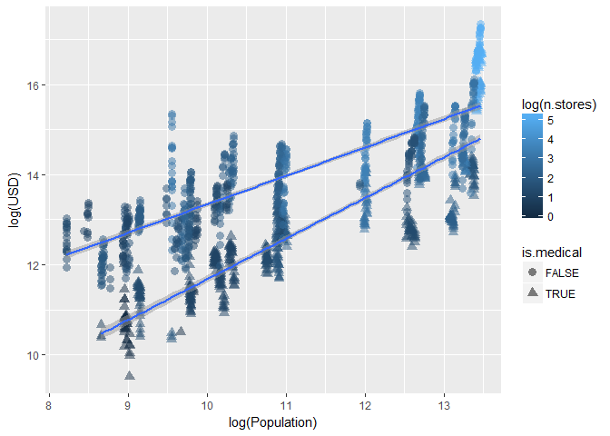
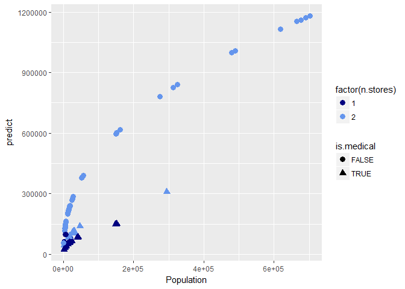
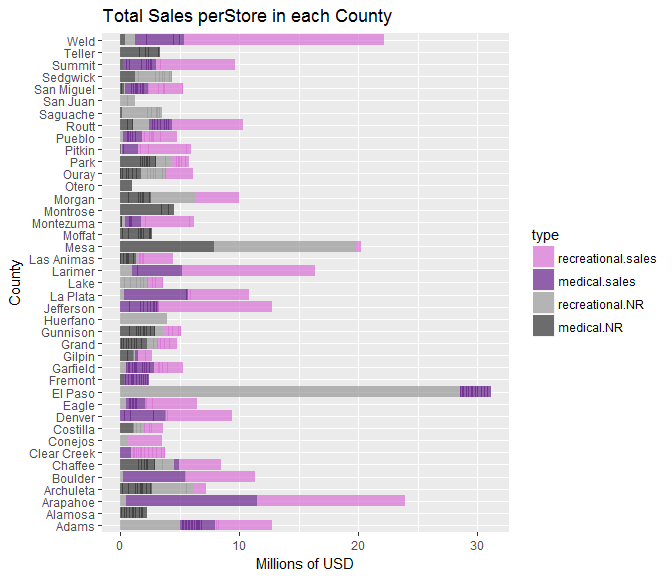

The state of Colorado has had legal recreational cannabis usage since 2014. In that time, more thant 4 Million dollars of Cannabis has been sold across the state fueling the local economies. 

The state regularly publishes the monthly cannabis sales in each county, with only a few exceptions.
The exceptions are those counties where the sales data is from less than 3 tax-payers (store owners). In these cases, for privacy, the state combines these counties and reports the Sum of all No Report ("NR") Counties. 

I estimate the sales in the NR Counties with linear regression to predict the amount of sales based on the county population and number of stores. Future work can add more predictors such as presence of regulations and more demographic information. I use those predictions and the known Sum of NR Counties to arrive at an estimate for the monthly sales in each of the NR Counties.


### Get Supporting Data

First I get all the supporting data for the project. The _R_ scripts loaded below are available on my github at https://github.com/lisamariepritchett/CannabisSalesColorado. All the coded needed to download data from state websites, read it into _R_, and clean and processes it is provided.


```r
source('data/get_county_populations.R')
source('data/get_county_centers.R')
source('data/get_stores.R')
```

The scripts return data regarding each county in Colorado and its population for each year between 2014 and 2017. I also download a list of all of the medical and recreational cannabis outlets across the state. Note this is a current list. Historical information on medical and retail outles is available at the state website, but it is published as pdf files which are particularly hard to scrape. 

Next I visualize the population density using a Leaflet plot:


```r
county_details <- inner_join(county_centers,county_populations, by="County")
county_details %>% leaflet() %>% addProviderTiles(providers$Stamen.Terrain) %>% 
        addCircles(radius=sqrt(county_details$Population*2000), weight=0.5,
                   color='blue',fillOpacity = .05,
                   label=paste(county_details$County,
                               round(county_details$Population/1000),
                               'K Population'))
```

<!--html_preserve--><div id="htmlwidget-a0ca6cfbbf5058cf06cb" style="width:100%;height:480px;" class="leaflet html-widget"></div>
<script type="application/json" data-for="htmlwidget-a0ca6cfbbf5058cf06cb">{"x":{"options":{"crs":{"crsClass":"L.CRS.EPSG3857","code":null,"proj4def":null,"projectedBounds":null,"options":{}}},"calls":[{"method":"addProviderTiles","args":["Stamen.Terrain",null,null,{"errorTileUrl":"","noWrap":false,"zIndex":null,"unloadInvisibleTiles":null,"updateWhenIdle":null,"detectRetina":false,"reuseTiles":false}]},{"method":"addCircles","args":[[39.8455195416667,39.8455195416667,39.8455195416667,39.8455195416667,37.571542,37.571542,37.571542,37.571542,39.6873171785714,39.6873171785714,39.6873171785714,39.6873171785714,37.1925532,37.1925532,37.1925532,37.1925532,37.3429403333333,37.3429403333333,37.3429403333333,37.3429403333333,37.9806615,37.9806615,37.9806615,37.9806615,40.08435065625,40.08435065625,40.08435065625,40.08435065625,38.7184071666667,38.7184071666667,38.7184071666667,38.7184071666667,38.82650725,38.82650725,38.82650725,38.82650725,39.7293976,39.7293976,39.7293976,39.7293976,37.2028212857143,37.2028212857143,37.2028212857143,37.2028212857143,37.2522174285714,37.2522174285714,37.2522174285714,37.2522174285714,38.3015756,38.3015756,38.3015756,38.3015756,38.108415,38.108415,38.108415,38.108415,38.8365959,38.8365959,38.8365959,38.8365959,39.7,39.7,39.7,39.7,37.7067543333333,37.7067543333333,37.7067543333333,37.7067543333333,39.406145,39.406145,39.406145,39.406145,39.6534494615385,39.6534494615385,39.6534494615385,39.6534494615385,38.858094016129,38.858094016129,38.858094016129,38.858094016129,39.2779128333333,39.2779128333333,39.2779128333333,39.2779128333333,38.3961340833333,38.3961340833333,38.3961340833333,38.3961340833333,39.5075545,39.5075545,39.5075545,39.5075545,39.8404733333333,39.8404733333333,39.8404733333333,39.8404733333333,40.036006875,40.036006875,40.036006875,40.036006875,38.6604889090909,38.6604889090909,38.6604889090909,38.6604889090909,38.026256,38.026256,38.026256,38.026256,37.664501,37.664501,37.664501,37.664501,40.5722355,40.5722355,40.5722355,40.5722355,39.6505392121212,39.6505392121212,39.6505392121212,39.6505392121212,38.43816325,38.43816325,38.43816325,38.43816325,39.3109766666667,39.3109766666667,39.3109766666667,39.3109766666667,37.2300916666667,37.2300916666667,37.2300916666667,37.2300916666667,39.1982513333333,39.1982513333333,39.1982513333333,39.1982513333333,40.564773,40.564773,40.564773,40.564773,37.2680880909091,37.2680880909091,37.2680880909091,37.2680880909091,39.1420531666667,39.1420531666667,39.1420531666667,39.1420531666667,40.727151375,40.727151375,40.727151375,40.727151375,39.0880537777778,39.0880537777778,39.0880537777778,39.0880537777778,37.761293,37.761293,37.761293,37.761293,40.570502,40.570502,40.570502,40.570502,37.416888375,37.416888375,37.416888375,37.416888375,38.3704583333333,38.3704583333333,38.3704583333333,38.3704583333333,40.308704125,40.308704125,40.308704125,40.308704125,38.0287736666667,38.0287736666667,38.0287736666667,38.0287736666667,38.132559,38.132559,38.132559,38.132559,39.1768777,39.1768777,39.1768777,39.1768777,40.6018665,40.6018665,40.6018665,40.6018665,39.2381386666667,39.2381386666667,39.2381386666667,39.2381386666667,38.0183464,38.0183464,38.0183464,38.0183464,38.1504858,38.1504858,38.1504858,38.1504858,39.9520975,39.9520975,39.9520975,39.9520975,37.61731175,37.61731175,37.61731175,37.61731175,40.3868372222222,40.3868372222222,40.3868372222222,40.3868372222222,38.1297866666667,38.1297866666667,38.1297866666667,38.1297866666667,37.848391,37.848391,37.848391,37.848391,37.9688412,37.9688412,37.9688412,37.9688412,40.8756266666667,40.8756266666667,40.8756266666667,40.8756266666667,39.6070604,39.6070604,39.6070604,39.6070604,38.8818346666667,38.8818346666667,38.8818346666667,38.8818346666667,39.8679853333333,39.8679853333333,39.8679853333333,39.8679853333333,40.3990717435897,40.3990717435897,40.3990717435897,40.3990717435897,39.9206124285714,39.9206124285714,39.9206124285714,39.9206124285714],[-104.726492416667,-104.726492416667,-104.726492416667,-104.726492416667,-105.82987375,-105.82987375,-105.82987375,-105.82987375,-104.600573892857,-104.600573892857,-104.600573892857,-104.600573892857,-107.1347994,-107.1347994,-107.1347994,-107.1347994,-102.542615833333,-102.542615833333,-102.542615833333,-102.542615833333,-103.015716,-103.015716,-103.015716,-103.015716,-105.3414055625,-105.3414055625,-105.3414055625,-105.3414055625,-106.191506166667,-106.191506166667,-106.191506166667,-106.191506166667,-102.6535915,-102.6535915,-102.6535915,-102.6535915,-105.6707984,-105.6707984,-105.6707984,-105.6707984,-106.01636,-106.01636,-106.01636,-106.01636,-105.470812142857,-105.470812142857,-105.470812142857,-105.470812142857,-103.7833998,-103.7833998,-103.7833998,-103.7833998,-105.2848065,-105.2848065,-105.2848065,-105.2848065,-107.8409976,-107.8409976,-107.8409976,-107.8409976,-105,-105,-105,-105,-108.582805,-108.582805,-108.582805,-108.582805,-104.919534727273,-104.919534727273,-104.919534727273,-104.919534727273,-106.644773615385,-106.644773615385,-106.644773615385,-106.644773615385,-104.659454032258,-104.659454032258,-104.659454032258,-104.659454032258,-104.246226166667,-104.246226166667,-104.246226166667,-104.246226166667,-105.411971916667,-105.411971916667,-105.411971916667,-105.411971916667,-107.653505625,-107.653505625,-107.653505625,-107.653505625,-105.523051,-105.523051,-105.523051,-105.523051,-105.973981875,-105.973981875,-105.973981875,-105.973981875,-106.925913181818,-106.925913181818,-106.925913181818,-106.925913181818,-107.276581,-107.276581,-107.276581,-107.276581,-105.09179025,-105.09179025,-105.09179025,-105.09179025,-106.31136425,-106.31136425,-106.31136425,-106.31136425,-105.18324730303,-105.18324730303,-105.18324730303,-105.18324730303,-102.9142575,-102.9142575,-102.9142575,-102.9142575,-102.66238,-102.66238,-102.66238,-102.66238,-107.912681333333,-107.912681333333,-107.912681333333,-107.912681333333,-106.364214333333,-106.364214333333,-106.364214333333,-106.364214333333,-105.312059833333,-105.312059833333,-105.312059833333,-105.312059833333,-104.340075909091,-104.340075909091,-104.340075909091,-104.340075909091,-103.4900195,-103.4900195,-103.4900195,-103.4900195,-103.158321625,-103.158321625,-103.158321625,-103.158321625,-108.516033277778,-108.516033277778,-108.516033277778,-108.516033277778,-106.981852,-106.981852,-106.981852,-106.981852,-107.977700285714,-107.977700285714,-107.977700285714,-107.977700285714,-108.591404375,-108.591404375,-108.591404375,-108.591404375,-108.335391666667,-108.335391666667,-108.335391666667,-108.335391666667,-103.81420275,-103.81420275,-103.81420275,-103.81420275,-103.730325,-103.730325,-103.730325,-103.730325,-107.728036,-107.728036,-107.728036,-107.728036,-105.7416875,-105.7416875,-105.7416875,-105.7416875,-102.40664275,-102.40664275,-102.40664275,-102.40664275,-106.8441035,-106.8441035,-106.8441035,-106.8441035,-102.4122948,-102.4122948,-102.4122948,-102.4122948,-104.6040895,-104.6040895,-104.6040895,-104.6040895,-108.3471925,-108.3471925,-108.3471925,-108.3471925,-106.4315005,-106.4315005,-106.4315005,-106.4315005,-106.954636888889,-106.954636888889,-106.954636888889,-106.954636888889,-106.061172,-106.061172,-106.061172,-106.061172,-107.680381,-107.680381,-107.680381,-107.680381,-108.19474,-108.19474,-108.19474,-108.19474,-102.383488333333,-102.383488333333,-102.383488333333,-102.383488333333,-106.0917826,-106.0917826,-106.0917826,-106.0917826,-105.163477166667,-105.163477166667,-105.163477166667,-105.163477166667,-103.226989666667,-103.226989666667,-103.226989666667,-103.226989666667,-104.640481923077,-104.640481923077,-104.640481923077,-104.640481923077,-102.485545285714,-102.485545285714,-102.485545285714,-102.485545285714],[30976.6686394777,31302.4919135841,31549.1045831732,31920.9441339068,5629.38717801503,5651.1945639838,5679.96478862325,5711.04424602016,35154.9711989642,35470.1564699114,35700.2520999502,35964.5642542767,4951.36344858666,4983.37235213264,5080.74797643024,5128.79431055682,2692.21098727421,2681.04457255003,2667.20827833148,2662.55587171424,3390.28022440624,3419.64910480593,3354.40009539709,3364.74905810225,25027.5847815965,25241.6322768556,25376.7216164736,25518.8899601844,6076.01843315176,6099.67212233576,6180.12944848245,6227.55366897789,1921.97814763852,1913.1126469709,1925.0974001333,1925.54194449251,4291.85274677499,4334.05122258609,4345.80257259807,4348.72500395231,4061.03435099975,4018.45741547674,4009.7381460639,4014.03211048442,2668.33281282527,2672.8262195661,2722.86613699609,2734.11071063335,3331.66624979154,3337.36422944814,3229.24139698475,3242.65891114067,2955.67251230579,2985.63226134767,3038.74974290414,3054.49621443537,7744.41734412603,7742.480222771,7806.53572335386,7818.20898415999,36410.3007403125,36896.0160450963,37236.8634554523,37508.9898744288,1982.4227601599,1985.95065396903,2017.4241001832,2024.94822699248,25091.9907540235,25384.9561748686,25625.3780459918,25866.0132181208,10272.3901795054,10326.6645147405,10385.374331241,10473.0025398641,36470.5908918405,36774.3932648793,37153.9230768434,37454.0708628582,6941.61364525569,7019.9715099137,7094.92776566471,7273.35254610967,9632.13372000202,9660.12422280376,9745.46048168069,9753.97994871837,10701.4017773374,10749.7906956368,10861.3074719391,10979.2100845188,3396.76316513236,3412.91664123225,3442.67337980239,3453.20335833267,5376.05803540103,5404.07253837326,5484.34134605059,5544.49421137763,5615.51422400478,5673.97567848154,5726.08068402812,5763.56767115647,1244.18648119966,1238.54753643128,1244.98995979887,1261.07819836836,3576.31094844953,3593.32714903611,3644.72221163699,3642.61017568446,1666.73333200005,1644.99240119825,1643.77614047656,1640.9754909809,33424.8410617014,33604.1366501209,33814.5235069193,34018.4357723867,1669.73051717934,1670.92788593643,1641.34091522755,1642.09729066216,4009.7381460639,4054.3803472294,3908.70822651167,3918.67533766195,10390.1876787669,10474.4450927006,10554.3356020168,10677.4620617448,3839.27076409049,3873.49970956498,3897.43505398102,3905.09047244747,25459.9685781424,25800.3875939878,26025.4875074416,26269.1827394763,5306.22276200312,5303.01800864376,5306.97654036646,5307.18788625389,3319.33728325399,3331.36608615745,3332.86663399543,3351.27784911965,6648.15763952691,6651.61634491948,6640.33131703532,6679.86784899222,17219.1753577226,17264.0088044463,17362.6610863658,17435.7657130394,1179.83049630021,1207.47670784989,1214.0840168621,1219.92225235873,5072.6718797888,5076.21906540685,5116.24862570223,5122.9206786754,7184.14921894026,7228.96949779151,7335.66629557261,7408.80285606251,9029.83942271401,9032.71830624646,9101.75807193314,9185.78317183679,7500.26666192609,7513.98695766768,7503.06603995993,7541.26727281297,6065.97065604508,6044.00529450463,6048.14021001498,6055.49723639603,3027.20993655874,3048.60623892296,3112.55522039369,3134.59937025451,5719.44053208004,5782.04116208109,5879.62583843564,5934.36804891641,2959.3918294136,2934.96166925567,2927.45623366089,2924.94145958513,5936.83417319366,5974.11081249754,5962.04662846577,6000.968561824,4903.67209344181,4879.54915950234,4866.41551863381,4874.68283686231,17978.7652523748,18066.3222599399,18171.9013864813,18276.8952724471,3640.3296554021,3613.58547705738,3604.71912914169,3608.82982890576,4804.58114719691,4777.65632920578,4779.95815881269,4782.38273039706,6929.64645562817,6972.80431390413,7025.5248914227,7090.27090878762,3513.11827298769,3526.75488232454,3578.82662335017,3593.85564429068,1199.1663771137,1179.83049630021,1181.52443901935,1186.36006718028,3937.25792906688,3960.55551659108,4000,4066.06583493184,2159.16650585359,2185.86367369971,2200.45449850707,2196.20716327035,7643.69020826983,7736.66594858535,7793.20216599056,7868.84239262676,6841.34489702134,6845.58251721503,6950.39567219018,7021.38205911059,3089.33649834394,3109.3407661432,3122.4989991992,3131.98087861341,23488.0820843252,23856.6971729114,24265.0777868112,24690.2016152157,4511.76240509183,4483.74843183692,4490.4342774391,4503.86246459636],null,null,{"lineCap":null,"lineJoin":null,"clickable":true,"pointerEvents":null,"className":"","stroke":true,"color":"blue","weight":0.5,"opacity":0.5,"fill":true,"fillColor":"blue","fillOpacity":0.05,"dashArray":null},null,null,["Adams 480 K Population","Adams 490 K Population","Adams 498 K Population","Adams 509 K Population","Alamosa 16 K Population","Alamosa 16 K Population","Alamosa 16 K Population","Alamosa 16 K Population","Arapahoe 618 K Population","Arapahoe 629 K Population","Arapahoe 637 K Population","Arapahoe 647 K Population","Archuleta 12 K Population","Archuleta 12 K Population","Archuleta 13 K Population","Archuleta 13 K Population","Baca 4 K Population","Baca 4 K Population","Baca 4 K Population","Baca 4 K Population","Bent 6 K Population","Bent 6 K Population","Bent 6 K Population","Bent 6 K Population","Boulder 313 K Population","Boulder 319 K Population","Boulder 322 K Population","Boulder 326 K Population","Chaffee 18 K Population","Chaffee 19 K Population","Chaffee 19 K Population","Chaffee 19 K Population","Cheyenne 2 K Population","Cheyenne 2 K Population","Cheyenne 2 K Population","Cheyenne 2 K Population","Clear Creek 9 K Population","Clear Creek 9 K Population","Clear Creek 9 K Population","Clear Creek 9 K Population","Conejos 8 K Population","Conejos 8 K Population","Conejos 8 K Population","Conejos 8 K Population","Costilla 4 K Population","Costilla 4 K Population","Costilla 4 K Population","Costilla 4 K Population","Crowley 6 K Population","Crowley 6 K Population","Crowley 5 K Population","Crowley 5 K Population","Custer 4 K Population","Custer 4 K Population","Custer 5 K Population","Custer 5 K Population","Delta 30 K Population","Delta 30 K Population","Delta 30 K Population","Delta 31 K Population","Denver 663 K Population","Denver 681 K Population","Denver 693 K Population","Denver 703 K Population","Dolores 2 K Population","Dolores 2 K Population","Dolores 2 K Population","Dolores 2 K Population","Douglas 315 K Population","Douglas 322 K Population","Douglas 328 K Population","Douglas 335 K Population","Eagle 53 K Population","Eagle 53 K Population","Eagle 54 K Population","Eagle 55 K Population","El Paso 665 K Population","El Paso 676 K Population","El Paso 690 K Population","El Paso 701 K Population","Elbert 24 K Population","Elbert 25 K Population","Elbert 25 K Population","Elbert 26 K Population","Fremont 46 K Population","Fremont 47 K Population","Fremont 47 K Population","Fremont 48 K Population","Garfield 57 K Population","Garfield 58 K Population","Garfield 59 K Population","Garfield 60 K Population","Gilpin 6 K Population","Gilpin 6 K Population","Gilpin 6 K Population","Gilpin 6 K Population","Grand 14 K Population","Grand 15 K Population","Grand 15 K Population","Grand 15 K Population","Gunnison 16 K Population","Gunnison 16 K Population","Gunnison 16 K Population","Gunnison 17 K Population","Hinsdale 1 K Population","Hinsdale 1 K Population","Hinsdale 1 K Population","Hinsdale 1 K Population","Huerfano 6 K Population","Huerfano 6 K Population","Huerfano 7 K Population","Huerfano 7 K Population","Jackson 1 K Population","Jackson 1 K Population","Jackson 1 K Population","Jackson 1 K Population","Jefferson 559 K Population","Jefferson 565 K Population","Jefferson 572 K Population","Jefferson 579 K Population","Kiowa 1 K Population","Kiowa 1 K Population","Kiowa 1 K Population","Kiowa 1 K Population","Kit Carson 8 K Population","Kit Carson 8 K Population","Kit Carson 8 K Population","Kit Carson 8 K Population","La Plata 54 K Population","La Plata 55 K Population","La Plata 56 K Population","La Plata 57 K Population","Lake 7 K Population","Lake 8 K Population","Lake 8 K Population","Lake 8 K Population","Larimer 324 K Population","Larimer 333 K Population","Larimer 339 K Population","Larimer 345 K Population","Las Animas 14 K Population","Las Animas 14 K Population","Las Animas 14 K Population","Las Animas 14 K Population","Lincoln 6 K Population","Lincoln 6 K Population","Lincoln 6 K Population","Lincoln 6 K Population","Logan 22 K Population","Logan 22 K Population","Logan 22 K Population","Logan 22 K Population","Mesa 148 K Population","Mesa 149 K Population","Mesa 151 K Population","Mesa 152 K Population","Mineral 1 K Population","Mineral 1 K Population","Mineral 1 K Population","Mineral 1 K Population","Moffat 13 K Population","Moffat 13 K Population","Moffat 13 K Population","Moffat 13 K Population","Montezuma 26 K Population","Montezuma 26 K Population","Montezuma 27 K Population","Montezuma 27 K Population","Montrose 41 K Population","Montrose 41 K Population","Montrose 41 K Population","Montrose 42 K Population","Morgan 28 K Population","Morgan 28 K Population","Morgan 28 K Population","Morgan 28 K Population","Otero 18 K Population","Otero 18 K Population","Otero 18 K Population","Otero 18 K Population","Ouray 5 K Population","Ouray 5 K Population","Ouray 5 K Population","Ouray 5 K Population","Park 16 K Population","Park 17 K Population","Park 17 K Population","Park 18 K Population","Phillips 4 K Population","Phillips 4 K Population","Phillips 4 K Population","Phillips 4 K Population","Pitkin 18 K Population","Pitkin 18 K Population","Pitkin 18 K Population","Pitkin 18 K Population","Prowers 12 K Population","Prowers 12 K Population","Prowers 12 K Population","Prowers 12 K Population","Pueblo 162 K Population","Pueblo 163 K Population","Pueblo 165 K Population","Pueblo 167 K Population","Rio Blanco 7 K Population","Rio Blanco 7 K Population","Rio Blanco 6 K Population","Rio Blanco 7 K Population","Rio Grande 12 K Population","Rio Grande 11 K Population","Rio Grande 11 K Population","Rio Grande 11 K Population","Routt 24 K Population","Routt 24 K Population","Routt 25 K Population","Routt 25 K Population","Saguache 6 K Population","Saguache 6 K Population","Saguache 6 K Population","Saguache 6 K Population","San Juan 1 K Population","San Juan 1 K Population","San Juan 1 K Population","San Juan 1 K Population","San Miguel 8 K Population","San Miguel 8 K Population","San Miguel 8 K Population","San Miguel 8 K Population","Sedgwick 2 K Population","Sedgwick 2 K Population","Sedgwick 2 K Population","Sedgwick 2 K Population","Summit 29 K Population","Summit 30 K Population","Summit 30 K Population","Summit 31 K Population","Teller 23 K Population","Teller 23 K Population","Teller 24 K Population","Teller 25 K Population","Washington 5 K Population","Washington 5 K Population","Washington 5 K Population","Washington 5 K Population","Weld 276 K Population","Weld 285 K Population","Weld 294 K Population","Weld 305 K Population","Yuma 10 K Population","Yuma 10 K Population","Yuma 10 K Population","Yuma 10 K Population"],null,null,null]}],"limits":{"lat":[37.1925532,40.8756266666667],"lng":[-108.591404375,-102.383488333333]}},"evals":[],"jsHooks":[]}</script><!--/html_preserve-->

```r
DenverMetroArea <- c('Denver','Jefferson','Adams','Arapahoe','Douglas')
GreaterDenverArea <- c(DenverMetroArea, 'Boulder', 'El Paso')
FrontRange <- c(GreaterDenverArea, 'Larimer','Weld','Pueblo')
```

The area of each of the circles represnets the population of the county it is centered around. 
We can see Denver is the population center. 
Several counties representing the Denver Metro Area (DMA). 
The next largest counties Boulder and El Paso (Colorado Springs) are adjascent to the DMA, and make up the Greater Denver Area. 
The population is most dense along the Front Range spanning from Larimer County (Ft Collins) to Pueblo. The only county outside the front range with more than 100,000 people is Mesa (Grand Junction) at the western border.

Next we can plot the density of cannabis stores across the state. Below a cluster map is used to show the density of licensed medical and retail outlets across the state. 


```r
combined_stores %>% leaflet() %>% addProviderTiles(providers$CartoDB) %>% 
        addMarkers(clusterOptions = markerClusterOptions(), 
                   label = paste(combined_stores$zip_code,
                                 combined_stores$LICENSEE,
                                 'Medical:', 
                                 !is.na(combined_stores$med.license),
                                 'Retail:',
                                 !is.na(combined_stores$retail.license)))
```

<!--html_preserve--><div id="htmlwidget-25cda4c7e15eaef27d98" style="width:100%;height:480px;" class="leaflet html-widget"></div>
<script type="application/json" data-for="htmlwidget-25cda4c7e15eaef27d98">{"x":{"options":{"crs":{"crsClass":"L.CRS.EPSG3857","code":null,"proj4def":null,"projectedBounds":null,"options":{}}},"calls":[{"method":"addProviderTiles","args":["CartoDB",null,null,{"errorTileUrl":"","noWrap":false,"zIndex":null,"unloadInvisibleTiles":null,"updateWhenIdle":null,"detectRetina":false,"reuseTiles":false}]},{"method":"addMarkers","args":[[38.065284,39.760189,38.804094,39.695014,39.707186,39.720136,39.768286,39.732436,39.777036,39.777036,39.720136,39.720136,39.729205,37.479933,40.59889,38.880713,38.177464,38.861981,38.828893,38.838268,38.861981,38.861981,39.765291,39.695014,39.720136,39.707332,38.414125,39.720236,39.760189,39.68493,39.695014,39.777036,38.113259,39.112138,40.129416,37.318364,39.821626,39.725703,38.844319,39.638537,39.701677,39.760137,38.90319,38.838268,38.838268,38.943076,38.943076,39.707332,39.707332,39.867235,39.648958,38.943076,39.804398,39.804398,38.844319,39.804398,39.701677,39.476857,38.804094,40.067772,39.910774,39.776986,40.067772,40.067772,38.90319,39.720136,39.743636,39.707186,38.81033,40.094787,38.838268,38.402934,37.269059,38.838268,38.838268,38.874436,40.384991,38.943076,39.768286,39.720136,39.730787,38.82513,38.874436,38.861981,39.695014,39.777036,39.730787,39.869835,40.59889,39.701677,39.709343,39.476857,39.701677,39.777036,39.095369,38.113259,39.720136,39.68493,39.695014,38.387004,39.804398,40.159043,39.169324,39.707186,39.701677,38.387004,39.707186,39.760189,39.760189,39.688776,39.645837,39.980835,38.861981,39.169324,39.743486,38.861981,40.094787,39.720136,38.81033,39.707186,40.632683,40.875703,38.943076,37.373594,39.777036,39.777036,39.777036,39.777036,39.760137,37.269059,39.760137,39.760137,39.701677,39.730787,39.729205,39.760137,39.765291,38.838268,38.874436,37.373594,null,38.945534,38.087325,40.59889,38.844319,38.943076,38.844319,38.943076,38.838268,39.867235,39.867235,38.387004,39.720136,39.768286,39.765291,39.732436,38.838268,40.59889,39.777036,38.804094,37.269059,39.869835,39.804398,38.838268,39.701677,37.479933,38.838268,38.861981,40.632683,38.844319,38.828893,39.720136,39.702037,39.804398,38.838268,38.844319,39.702037,39.702037,38.838268,39.707186,39.777036,39.821626,39.713186,39.729205,39.760137,39.68493,39.910774,null,39.743486,40.59889,40.532277,39.500281,39.597937,39.500281,38.838268,39.867235,39.732436,39.631349,38.804094,38.874436,38.838268,40.530475,39.732436,38.885032,38.838268,39.75315,39.712337,40.094787,39.701677,39.765291,39.631349,38.838268,38.844319,38.943076,39.720136,39.648958,39.582273,39.709343,40.026334,39.707186,39.701677,38.943076,39.695014,39.765291,39.701677,39.709343,38.943076,38.874436,39.597937,39.707186,39.708637,39.979743,39.777036,37.318364,38.861981,38.838268,38.828893,38.923901,37.202251,39.631349,38.838268,39.743636,39.713186,38.477727,39.649837,38.90319,38.861981,38.81033,39.765291,40.063935,39.729205,39.777036,39.544307,39.707186,39.707186,39.777036,39.720136,40.532277,39.708637,39.743486,38.838268,38.838268,38.861981,39.760137,37.106599,40.270654,39.804398,39.712337,null,39.713186,39.689487,39.701677,39.701677,39.804398,40.384991,38.874436,39.707186,39.777036,39.760189,38.861981,40.189788,39.804398,37.269059,39.707332,38.796074,38.387004,38.853366,39.729205,40.094787,38.828893,38.387004,39.720236,39.712337,38.90319,39.709343,39.776986,39.768286,39.709343,38.087325,39.732436,39.597937,39.765291,37.318364,39.689487,39.729205,39.720136,39.760137,38.838268,39.707186,39.777036,39.760137,38.90319,40.063935,39.707186,39.768286,39.631349,38.828893,38.90319,38.838268,38.943076,38.844319,40.532277,40.530475,38.828893,39.707186,39.720236,40.384991,40.270654,null,38.90319,38.943076,39.709343,39.707186,40.026334,39.695014,39.743636,38.844319,39.709343,38.402934,40.000686,39.776986,40.59889,39.760189,38.387004,40.067772,39.475323,38.838268,38.443069,38.861981,38.828893,39.701677,39.777036,39.729205,39.707186,39.701677,39.901534,39.777036,38.804094,38.828893,38.943076,38.943076,39.720136,39.765291,38.943076,38.838268,39.712337,39.804398,39.743636,38.804094,38.387004,38.796074,38.938149,38.838268,38.838268,39.582273,39.804398,39.582273,39.760137,39.777036,38.838268,39.169324,38.90319,39.743636,39.558929,39.765291,40.165634,39.695014,39.707186,39.620596,38.861981,39.83776,38.861981,40.632683,39.732436,40.189788,37.995867,39.709343,39.777036,38.838268,38.828893,39.718539,39.743486,38.844319,38.804094,38.804094,39.695014,38.838268,39.958523,39.76193,38.087325,40.612421,39.765291,39.707186,39.743636,38.828893,38.838268,39.707186,39.75315,40.532277,39.776986,37.403455,38.943076,39.720136,38.838268,39.765291,39.695014,39.707186,39.203721,40.094787,39.768286,39.607401,39.729205,39.701677,37.983589,39.777036,39.68493,38.844319,40.063935,38.943076,38.82513,38.804094,40.067772,39.765291,38.81033,38.844319,40.59889,39.597937,39.760189,38.838268,38.861981,39.707332,37.373594,38.838268,39.765291,39.765291,38.90319,38.113259,38.387004,38.844319,38.838268,38.943076,38.387004,39.707332,38.804094,39.702037,38.943076,38.861981,38.828893,39.804398,40.063935,37.269059,37.269059,38.965298,39.695014,39.760137,39.777036,39.764692,39.702037,39.495223,39.760137,39.760137,39.701677,39.765291,38.113259,39.689487,40.59227,38.477727,39.777036,39.701677,39.707186,39.701677,39.701677,39.68493,39.732436,39.777036,39.702037,38.943076,39.720136,39.582273,38.943076,38.113259,38.943076,38.838268,38.477727,39.720136,null,39.768286,38.629119,39.781442,39.788286,37.135059,39.81599,38.065284,37.135059,38.177464,37.848391,37.269059,39.910774,39.788286,39.901534,39.695014,39.475323,39.595212,39.720136,37.983589,39.81599,39.821626,39.68493,39.695014,39.777036,38.402934,40.000686,39.681201,39.715287,39.729205,40.063935,39.701677,39.743486,37.106599,40.094787,37.336041,38.880713,39.910774,39.760137,40.114114,40.063935,40.067772,39.475323,37.646467,39.458498,39.292409,40.094787,38.402934,39.869835,40.384991,39.720136,39.707186,null,39.203721,39.821626,39.777036,39.869835,40.59889,40.165634,39.095369,38.113259,39.706574,38.387004,37.269059,38.402934,39.804398,38.152191,40.159043,39.777036,40.063935,39.476857,39.760189,39.980835,40.026334,37.953038,39.169324,38.880713,39.720136,37.373594,37.202251,37.983589,39.777036,39.765291,39.777036,39.713186,39.730787,37.318364,39.732436,39.475323,39.788286,39.768286,37.983589,37.318364,37.318364,null,null,37.269059,38.087325,40.063935,38.629119,39.292409,37.269059,37.318364,37.269059,38.177464,38.387004,40.59889,39.777036,37.269059,40.063935,38.528323,39.867235,39.660437,38.121031,40.632683,39.707186,37.403455,38.387004,39.821626,39.461223,39.702037,39.458498,39.458498,39.500281,39.169324,39.667429,39.713186,39.729205,39.729205,37.373594,37.336041,40.532277,39.500281,39.867235,null,37.135059,39.732436,39.743636,39.500281,39.660654,38.528323,39.297972,39.701677,39.732436,40.094787,39.660437,39.979743,39.095369,39.502817,39.476857,39.706574,39.821626,37.202251,39.631349,39.21753,39.713186,37.202251,39.601172,39.667429,39.760189,40.063935,39.169324,40.063935,39.707186,39.777036,37.848391,39.867235,39.708637,39.169324,39.695014,39.292409,39.777036,37.318364,40.270654,40.270654,37.269059,39.707186,39.715287,39.729205,39.660437,40.384991,37.269059,40.159043,39.838028,40.067772,40.189788,37.269059,39.804398,38.387004,40.094787,37.269059,37.269059,39.500281,39.768286,39.709343,38.387004,38.113259,40.000686,39.720136,39.695014,39.707186,38.528323,40.063935,39.595212,39.297972,39.706574,39.708637,38.387004,40.384991,40.270654,null,39.638166,37.983589,37.357249,39.695014,40.36715,38.402934,40.067772,38.387004,40.027672,39.500281,39.169324,39.458498,37.269059,39.729205,39.901534,39.765291,38.387004,38.880713,38.528323,39.804398,39.708637,38.853366,39.169324,39.495223,39.638166,39.631349,38.528323,39.21753,39.502817,38.087325,39.777036,39.595212,40.165634,39.500281,39.707186,37.269059,40.632683,39.732436,40.189788,38.177464,39.458498,39.631349,39.901534,39.702142,37.202251,38.306022,39.601172,39.76193,39.949118,39.707332,39.732436,39.804398,39.21753,39.958523,40.094787,39.708637,39.776986,38.087325,37.269059,39.720136,37.373594,38.387004,39.715287,39.869835,39.980835,40.159043,38.152191,37.269059,38.087325,39.760137,39.707186,40.094787,39.607401,39.660654,38.402934,39.869835,39.648958,37.983589,38.629119,39.095369,38.121031,37.318364,39.458498,38.528323,39.901534,39.777036,39.695014,39.681201,39.743636,39.699631,39.660437,39.715287,39.788286,39.838028,37.269059,37.269059,39.708637,39.667429,38.087325,40.067772,37.269059,38.387004,39.707186,38.113259,38.387004,39.777036,39.458498,39.715287,37.269059,39.75315,39.476857,39.292409,39.558929,39.695014,39.760137,39.764692,39.707186,39.631349,40.59227,40.323272,39.68493,39.901534,39.720136,38.113259,38.528323,37.336041,39.149,40.384991],[-105.817955,-104.996553,-104.772059,-105.034339,-105.008762,-105.021502,-105.049338,-104.910843,-104.942034,-104.942034,-105.021502,-105.021502,-104.970331,-105.790967,-105.252751,-106.94868,-107.72736,-104.874531,-104.809929,-104.85023,-104.874531,-104.874531,-105.018387,-105.034339,-105.021502,-104.964236,-105.047277,-104.968759,-104.996553,-104.886785,-105.034339,-104.942034,-104.52127,-104.900328,-104.970816,-107.880367,-105.545631,-105.760626,-104.801472,-104.903984,-104.964186,-104.967585,-104.807998,-104.85023,-104.85023,-104.81444,-104.81444,-104.964236,-104.964236,-105.004125,-104.973852,-104.81444,-104.813919,-104.813919,-104.801472,-104.813919,-104.964186,-107.38813,-104.772059,-105.27484,-105.010886,-105.108182,-105.27484,-105.27484,-104.807998,-105.021502,-105.064336,-105.008762,-104.718555,-105.278083,-104.85023,-104.644423,-104.5038,-104.85023,-104.85023,-104.751515,-104.680631,-104.81444,-105.049338,-105.021502,-104.953335,-104.746689,-104.751515,-104.874531,-105.034339,-104.942034,-104.953335,-104.771527,-105.252751,-104.964186,-104.924134,-107.38813,-104.964186,-104.942034,-108.299254,-104.52127,-105.021502,-104.886785,-105.034339,-104.779156,-104.813919,-105.212558,-106.776744,-105.008762,-104.964186,-104.779156,-105.008762,-104.996553,-104.996553,-105.156,-105.065003,-105.269915,-104.874531,-106.776744,-105.100854,-104.874531,-105.278083,-105.021502,-104.718555,-105.008762,-106.931827,-102.44023,-104.81444,-108.662826,-104.942034,-104.942034,-104.942034,-104.942034,-104.967585,-104.5038,-104.967585,-104.967585,-104.964186,-104.953335,-104.970331,-104.967585,-105.018387,-104.85023,-104.751515,-108.662826,null,-104.994972,-104.822451,-105.252751,-104.801472,-104.81444,-104.801472,-104.81444,-104.85023,-105.004125,-105.004125,-104.779156,-105.021502,-105.049338,-105.018387,-104.910843,-104.85023,-105.252751,-104.942034,-104.772059,-104.5038,-104.771527,-104.813919,-104.85023,-104.964186,-105.790967,-104.85023,-104.874531,-106.931827,-104.801472,-104.809929,-105.021502,-104.911434,-104.813919,-104.85023,-104.801472,-104.911434,-104.911434,-104.85023,-105.008762,-104.942034,-105.545631,-104.903532,-104.970331,-104.967585,-104.886785,-105.010886,null,-105.100854,-105.252751,-105.207073,-107.585235,-105.010182,-107.585235,-104.85023,-105.004125,-104.910843,-106.510843,-104.772059,-104.751515,-104.85023,-105.321046,-104.910843,-106.179938,-104.85023,-105.635592,-105.091784,-105.278083,-104.964186,-105.018387,-106.510843,-104.85023,-104.801472,-104.81444,-105.021502,-104.973852,-107.794723,-104.924134,-105.104899,-105.008762,-104.964186,-104.81444,-105.034339,-105.018387,-104.964186,-104.924134,-104.81444,-104.751515,-105.010182,-105.008762,-104.931234,-105.86148,-104.942034,-107.880367,-104.874531,-104.85023,-104.809929,-105.185653,-107.12619,-106.510843,-104.85023,-105.064336,-104.903532,-105.507603,-105.034988,-104.807998,-104.874531,-104.718555,-105.018387,-105.390027,-104.970331,-104.942034,-105.153074,-105.008762,-105.008762,-104.942034,-105.021502,-105.207073,-104.931234,-105.100854,-104.85023,-104.85023,-104.874531,-104.967585,-105.47813,-103.833813,-104.813919,-105.091784,null,-104.903532,-105.090779,-104.964186,-104.964186,-104.813919,-104.680631,-104.751515,-105.008762,-104.942034,-104.996553,-104.874531,-105.35528,-104.813919,-104.5038,-104.964236,-104.841763,-104.779156,-104.927452,-104.970331,-105.278083,-104.809929,-104.779156,-104.968759,-105.091784,-104.807998,-104.924134,-105.108182,-105.049338,-104.924134,-104.822451,-104.910843,-105.010182,-105.018387,-107.880367,-105.090779,-104.970331,-105.021502,-104.967585,-104.85023,-105.008762,-104.942034,-104.967585,-104.807998,-105.390027,-105.008762,-105.049338,-106.510843,-104.809929,-104.807998,-104.85023,-104.81444,-104.801472,-105.207073,-105.321046,-104.809929,-105.008762,-104.968759,-104.680631,-103.833813,null,-104.807998,-104.81444,-104.924134,-105.008762,-105.104899,-105.034339,-105.064336,-104.801472,-104.924134,-104.644423,-105.495998,-105.108182,-105.252751,-104.996553,-104.779156,-105.27484,-106.022472,-104.85023,-108.050689,-104.874531,-104.809929,-104.964186,-104.942034,-104.970331,-105.008762,-104.964186,-104.940683,-104.942034,-104.772059,-104.809929,-104.81444,-104.81444,-105.021502,-105.018387,-104.81444,-104.85023,-105.091784,-104.813919,-105.064336,-104.772059,-104.779156,-104.841763,-104.917436,-104.85023,-104.85023,-107.794723,-104.813919,-107.794723,-104.967585,-104.942034,-104.85023,-106.776744,-104.807998,-105.064336,-106.133183,-105.018387,-105.1633,-105.034339,-105.008762,-105.090085,-104.874531,-104.697674,-104.874531,-106.931827,-104.910843,-105.35528,-103.708332,-104.924134,-104.942034,-104.85023,-104.809929,-105.245659,-105.100854,-104.801472,-104.772059,-104.772059,-105.034339,-104.85023,-105.792637,-105.665451,-104.822451,-108.009784,-105.018387,-105.008762,-105.064336,-104.809929,-104.85023,-105.008762,-105.635592,-105.207073,-105.108182,-105.415437,-104.81444,-105.021502,-104.85023,-105.018387,-105.034339,-105.008762,-105.747242,-105.278083,-105.049338,-106.805111,-104.970331,-104.964186,-107.956606,-104.942034,-104.886785,-104.801472,-105.390027,-104.81444,-104.746689,-104.772059,-105.27484,-105.018387,-104.718555,-104.801472,-105.252751,-105.010182,-104.996553,-104.85023,-104.874531,-104.964236,-108.662826,-104.85023,-105.018387,-105.018387,-104.807998,-104.52127,-104.779156,-104.801472,-104.85023,-104.81444,-104.779156,-104.964236,-104.772059,-104.911434,-104.81444,-104.874531,-104.809929,-104.813919,-105.390027,-104.5038,-104.5038,-104.755956,-105.034339,-104.967585,-104.942034,-106.221139,-104.911434,-106.804842,-104.967585,-104.967585,-104.964186,-105.018387,-104.52127,-105.090779,-105.298344,-105.507603,-104.942034,-104.964186,-105.008762,-104.964186,-104.964186,-104.886785,-104.910843,-104.942034,-104.911434,-104.81444,-105.021502,-107.794723,-104.81444,-104.52127,-104.81444,-104.85023,-105.507603,-105.021502,null,-105.049338,-106.120582,-104.685374,-104.822765,-106.190367,-105.475322,-105.817955,-106.190367,-107.72736,-107.680381,-104.5038,-105.010886,-104.822765,-104.940683,-105.034339,-106.022472,-105.974117,-105.021502,-107.956606,-105.475322,-105.545631,-104.886785,-105.034339,-104.942034,-104.644423,-105.495998,-104.80973,-104.84748,-104.970331,-105.390027,-104.964186,-105.100854,-105.47813,-105.278083,-108.468364,-106.94868,-105.010886,-104.967585,-105.369797,-105.390027,-105.27484,-106.022472,-104.779815,-107.878874,-108.210688,-105.278083,-104.644423,-104.771527,-104.680631,-105.021502,-105.008762,null,-105.747242,-105.545631,-104.942034,-104.771527,-105.252751,-105.1633,-108.299254,-104.52127,-105.541583,-104.779156,-104.5038,-104.644423,-104.813919,-104.841328,-105.212558,-104.942034,-105.390027,-107.38813,-104.996553,-105.269915,-105.104899,-105.68788,-106.776744,-106.94868,-105.021502,-108.662826,-107.12619,-107.956606,-104.942034,-105.018387,-104.942034,-104.903532,-104.953335,-107.880367,-104.910843,-106.022472,-104.822765,-105.049338,-107.956606,-107.880367,-107.880367,null,null,-104.5038,-104.822451,-105.390027,-106.120582,-108.210688,-104.5038,-107.880367,-104.5038,-107.72736,-104.779156,-105.252751,-104.942034,-104.5038,-105.390027,-107.037294,-105.004125,-104.82933,-104.763851,-106.931827,-105.008762,-105.415437,-104.779156,-105.545631,-105.658305,-104.911434,-107.878874,-107.878874,-107.585235,-106.776744,-104.775265,-104.903532,-104.970331,-104.970331,-108.662826,-108.468364,-105.207073,-107.585235,-105.004125,null,-106.190367,-104.910843,-105.064336,-107.585235,-104.76275,-107.037294,-106.063548,-104.964186,-104.910843,-105.278083,-104.82933,-105.86148,-108.299254,-107.665664,-107.38813,-105.541583,-105.545631,-107.12619,-106.510843,-106.35833,-104.903532,-107.12619,-104.739428,-104.775265,-104.996553,-105.390027,-106.776744,-105.390027,-105.008762,-104.942034,-107.680381,-105.004125,-104.931234,-106.776744,-105.034339,-108.210688,-104.942034,-107.880367,-103.833813,-103.833813,-104.5038,-105.008762,-104.84748,-104.970331,-104.82933,-104.680631,-104.5038,-105.212558,-104.998788,-105.27484,-105.35528,-104.5038,-104.813919,-104.779156,-105.278083,-104.5038,-104.5038,-107.585235,-105.049338,-104.924134,-104.779156,-104.52127,-105.495998,-105.021502,-105.034339,-105.008762,-107.037294,-105.390027,-105.974117,-106.063548,-105.541583,-104.931234,-104.779156,-104.680631,-103.833813,null,-106.620644,-107.956606,-107.935945,-105.034339,-108.277407,-104.644423,-105.27484,-104.779156,-105.3868,-107.585235,-106.776744,-107.878874,-104.5038,-104.970331,-104.940683,-105.018387,-104.779156,-106.94868,-107.037294,-104.813919,-104.931234,-104.927452,-106.776744,-106.804842,-106.620644,-106.510843,-107.037294,-106.35833,-107.665664,-104.822451,-104.942034,-105.974117,-105.1633,-107.585235,-105.008762,-104.5038,-106.931827,-104.910843,-105.35528,-107.72736,-107.878874,-106.510843,-104.940683,-104.80667,-107.12619,-106.046577,-104.739428,-105.665451,-105.816439,-104.964236,-104.910843,-104.813919,-106.35833,-105.792637,-105.278083,-104.931234,-105.108182,-104.822451,-104.5038,-105.021502,-108.662826,-104.779156,-104.84748,-104.771527,-105.269915,-105.212558,-104.841328,-104.5038,-104.822451,-104.967585,-105.008762,-105.278083,-106.805111,-104.76275,-104.644423,-104.771527,-104.973852,-107.956606,-106.120582,-108.299254,-104.763851,-107.880367,-107.878874,-107.037294,-104.940683,-104.942034,-105.034339,-104.80973,-105.064336,-105.75074,-104.82933,-104.84748,-104.822765,-104.998788,-104.5038,-104.5038,-104.931234,-104.775265,-104.822451,-105.27484,-104.5038,-104.779156,-105.008762,-104.52127,-104.779156,-104.942034,-107.878874,-104.84748,-104.5038,-105.635592,-107.38813,-108.210688,-106.133183,-105.034339,-104.967585,-106.221139,-105.008762,-106.510843,-105.298344,-106.944274,-104.886785,-104.940683,-105.021502,-104.52127,-107.037294,-108.468364,-105.885893,-104.680631],null,null,null,{"clickable":true,"draggable":false,"keyboard":true,"title":"","alt":"","zIndexOffset":0,"opacity":1,"riseOnHover":false,"riseOffset":250},null,null,{"showCoverageOnHover":true,"zoomToBoundsOnClick":true,"spiderfyOnMaxZoom":true,"removeOutsideVisibleBounds":true,"spiderLegPolylineOptions":{"weight":1.5,"color":"#222","opacity":0.5},"freezeAtZoom":false},null,["81143 1-11 LLC Medical: TRUE Retail: TRUE","80202 1617 WAZEE STREET LLC Medical: TRUE Retail: TRUE","80910 37 INC Medical: TRUE Retail: FALSE","80219 3B FEDERAL1 LLC Medical: TRUE Retail: TRUE","80223 3B KALAMATH LLC Medical: TRUE Retail: FALSE","80204 3B UMATILLA LLC Medical: TRUE Retail: FALSE","80212 3B-38 LLC Medical: TRUE Retail: FALSE","80220 4625 EAST COLFAX LLC Medical: TRUE Retail: TRUE","80216 505 CENTER LLC Medical: TRUE Retail: TRUE","80216 5110 RACE LLC Medical: TRUE Retail: TRUE","80204 5280 WELLNESS LLC Medical: TRUE Retail: FALSE","80204 A CUT OFF THE TOP MEDICAL MARIJUANA LLC Medical: TRUE Retail: TRUE","80203 ABUNDANT HEALTH DENVER LLC Medical: TRUE Retail: TRUE","81101 ACADEMY OF THE HEALING ARTS LLC Medical: TRUE Retail: FALSE","80524 ACES PLACE LLC Medical: TRUE Retail: TRUE","81224 ACME DISPENSARY INC Medical: TRUE Retail: TRUE","81432 ACME HEALING CENTER OF RIDGWAY LLC Medical: TRUE Retail: FALSE","80904 ADAMS GREEN CROSSING LLC Medical: TRUE Retail: FALSE","80903 ADAMS GREEN CROSSING LLC Medical: TRUE Retail: FALSE","80909 ADAMS GREEN CROSSING LLC Medical: TRUE Retail: FALSE","80904 ADVANCE CURE FOR VERA BESTURA LLC Medical: TRUE Retail: FALSE","80904 AJC INDUSTRIES LLC Medical: TRUE Retail: FALSE","80211 AJS EVANS LLC Medical: TRUE Retail: FALSE","80219 AJS FEDERAL LLC Medical: TRUE Retail: TRUE","80204 ALLGREENS LLC Medical: TRUE Retail: FALSE","80209 ALPINE HERBAL WELLNESS LLC Medical: TRUE Retail: FALSE","81240 ALTERNATIVE MEDICAL REMEDIES LLC Medical: TRUE Retail: FALSE","80218 ALTERNATIVE MEDICINE ON CAPITOL HILL LLC Medical: TRUE Retail: TRUE","80202 ALTERNATIVE MEDICINE ON THE MALL LLC Medical: TRUE Retail: TRUE","80231 ALTITUDE WELLNESS CENTER LLC Medical: TRUE Retail: FALSE","80219 AMERICAN INDUSTRY LLC Medical: TRUE Retail: FALSE","80216 AMERICAN INDUSTRY LLC Medical: TRUE Retail: FALSE","81006 AMERICAN PRIDE GROWERS LLC Medical: TRUE Retail: TRUE","80133 AMERICAN WHOLESALE LLC Medical: TRUE Retail: FALSE","80504 ANCIENT ALTERNATIVES LLC Medical: TRUE Retail: TRUE","81301 ANIMAS HERBAL WELLNESS CENTER INC Medical: TRUE Retail: TRUE","80427 ANNIES TOBACCO EMPORIUM LLC Medical: TRUE Retail: FALSE","80444 AREN &amp; DAVES DREAM LLC Medical: TRUE Retail: TRUE","80905 ARTISTANT DISPENSARY CTR INC Medical: TRUE Retail: FALSE","80237 ASCEND II LLC Medical: TRUE Retail: TRUE","80210 BACK TO THE GARDEN HEALTH &amp; WELLNESS CENTER LLC Medical: TRUE Retail: FALSE","80205 BALLPARK HOLISTIC DISPENSARY CORP Medical: TRUE Retail: TRUE","80918 BEST BUDZ LLC Medical: TRUE Retail: FALSE","80909 BEST BUDZ LLC Medical: TRUE Retail: FALSE","80909 BEST BUDZ LLC Medical: TRUE Retail: FALSE","80907 BEST BUDZ LLC Medical: TRUE Retail: FALSE","80907 BEST MEDS LLC Medical: TRUE Retail: FALSE","80209 BEYOND BROADWAY LLC Medical: TRUE Retail: TRUE","80209 BGOOD VENTURES LLC Medical: TRUE Retail: FALSE","80260 BGOOD VENTURES LLC Medical: TRUE Retail: FALSE","80110 BGOOD VENTURES LLC Medical: TRUE Retail: FALSE","80907 BIG MEDICINE LLC Medical: TRUE Retail: FALSE","80239 BIG TOE LLC Medical: TRUE Retail: TRUE","80239 BIOCARE INC Medical: TRUE Retail: FALSE","80905 BIOMEDS LLC Medical: TRUE Retail: FALSE","80239 BK HOLDINGS LLC Medical: TRUE Retail: TRUE","80210 BK HOLDINGS LLC Medical: TRUE Retail: TRUE","81623 BLACK DOG VALLEY LLC Medical: TRUE Retail: FALSE","80910 BND LLC Medical: TRUE Retail: FALSE","80303 BOLDER VENTURES LTD Medical: TRUE Retail: FALSE","80234 BOTANACARE LLC Medical: TRUE Retail: FALSE","80033 BOULDER COUNTY CAREGIVERS LLC Medical: TRUE Retail: FALSE","80303 BOULDER TREATMENTS LLC Medical: TRUE Retail: FALSE","80303 BOULDER WELLNESS CENTER LLC Medical: TRUE Retail: FALSE","80918 BRIARGATE WELLNESS CENTER LLC Medical: TRUE Retail: FALSE","80204 BTE LLC Medical: TRUE Retail: TRUE","80214 BUD MED HEALTH CENTERS LLC Medical: TRUE Retail: TRUE","80223 BUDDIES WELLNESS LLC Medical: TRUE Retail: FALSE","80916 BUKU LOUD LLC Medical: TRUE Retail: FALSE","80301 BUSHES LLC Medical: TRUE Retail: FALSE","80909 C^3 COLORADO SPRINGS LLC Medical: TRUE Retail: FALSE","81008 C^3 COLORADO SPRINGS LLC Medical: TRUE Retail: FALSE","81082 CANNA COMPANY Medical: TRUE Retail: TRUE","80909 CANNA MEDS WELLNESS CENTER LLC Medical: TRUE Retail: FALSE","80909 CANNA MEDS WELLNESS CENTER LLC Medical: TRUE Retail: FALSE","80915 CANNABICARE INC Medical: TRUE Retail: FALSE","80631 CANNABIS CARE WELLNESS CENTERS LLC Medical: TRUE Retail: FALSE","80907 CANNABIS CONNECTION LLC Medical: TRUE Retail: FALSE","80212 CANNABIS CORP Medical: TRUE Retail: TRUE","80204 CANNABIS FOR HEALTH LLC Medical: TRUE Retail: FALSE","80206 CAREGIVERS FOR LIFE LLC Medical: TRUE Retail: TRUE","80917 CC GROUP Medical: TRUE Retail: FALSE","80915 CC GROUP Medical: TRUE Retail: FALSE","80904 CC GROUP Medical: TRUE Retail: FALSE","80219 CG INDUSTRY LLC Medical: TRUE Retail: FALSE","80216 CG INDUSTRY LLC Medical: TRUE Retail: FALSE","80206 CG NETWORK LLC Medical: TRUE Retail: TRUE","80022 CGFR GROUP INC Medical: TRUE Retail: FALSE","80524 CHOICE ORGANICS INC Medical: TRUE Retail: FALSE","80210 CITI-MED LLC Medical: TRUE Retail: TRUE","80222 CJJ SERVICES LLC Medical: TRUE Retail: TRUE","81623 CMED LLC Medical: TRUE Retail: TRUE","80210 CO-AGRONOMICS LLC Medical: TRUE Retail: TRUE","80216 CO-AGRONOMICS LLC Medical: TRUE Retail: TRUE","81526 COLORADO ALTERNATIVE HEALTH CARE LTD Medical: TRUE Retail: FALSE","81006 COLORADO BEST BUDZ LLC Medical: TRUE Retail: FALSE","80204 COLORADO CANNABIS COMPANY LLC Medical: TRUE Retail: TRUE","80231 COLORADO CANNABIS SERVICES LLC Medical: TRUE Retail: FALSE","80219 COLORADO COLITAS LLC Medical: TRUE Retail: FALSE","81007 COLORADO DISTRIBUTING LLC Medical: TRUE Retail: FALSE","80239 COLORADO FARMS INC Medical: TRUE Retail: FALSE","80503 COLORADO HEALING LLC Medical: TRUE Retail: FALSE","81611 COLORADO MEDICAL MARIJUANA SUPPLY INC Medical: TRUE Retail: FALSE","80223 COLORADO WELLNESS CENTERS LLC Medical: TRUE Retail: FALSE","80210 COLORADO WELLNESS INC Medical: TRUE Retail: TRUE","81007 COMPASSIONATE CARE COOP Medical: TRUE Retail: FALSE","80223 COMPASSIONATE CARE GIVERS INC Medical: TRUE Retail: TRUE","80202 COMPASSIONATE CARE GIVERS INC Medical: TRUE Retail: TRUE","80202 COMPASSIONATE CARE GIVERS INC Medical: TRUE Retail: FALSE","80228 COMPASSIONATE ENTERPRISES LLC Medical: TRUE Retail: FALSE","80235 COMPASSIONATE ENTERPRISES LLC Medical: TRUE Retail: FALSE","80027 COMPASSIONATE PAIN MANAGEMENT LLC Medical: TRUE Retail: FALSE","80904 COMPLIANCE INITIATIVES LLC Medical: TRUE Retail: FALSE","81611 COOPER MASON VENTURES LLC Medical: TRUE Retail: FALSE","80215 CPM LAKEWOOD LLC Medical: TRUE Retail: FALSE","80904 CROSSPOINT 3132 LLC Medical: TRUE Retail: FALSE","80301 CROSSROADS WELLNESS LLC Medical: TRUE Retail: TRUE","80204 CURE MEDICAL PHARM INC Medical: TRUE Retail: FALSE","80916 CYS INC Medical: TRUE Retail: FALSE","80223 D &amp; D CONSULTING INC Medical: TRUE Retail: TRUE","80487 D and C MEDICAL MARIJUANA LLC Medical: TRUE Retail: TRUE","80749 DACONO MEDS LLC Medical: TRUE Retail: TRUE","80907 DANKERT CAPITAL LLC Medical: TRUE Retail: FALSE","81321 DAVID KRZYSZTOFIAK LLC Medical: TRUE Retail: FALSE","80216 DELTA-9 DELIGHTS LLC Medical: TRUE Retail: FALSE","80216 DENCO LLC Medical: TRUE Retail: TRUE","80216 DENCO LLC Medical: TRUE Retail: TRUE","80216 DENVER DISPENSARY LLC Medical: TRUE Retail: TRUE","80205 DENVER PATIENTS GROUP LLC Medical: TRUE Retail: TRUE","81082 DESSIMALS INC Medical: TRUE Retail: TRUE","80205 DGP 38TH LLC Medical: TRUE Retail: FALSE","80205 DGP WALNUT LLC Medical: TRUE Retail: TRUE","80210 DGS INC Medical: TRUE Retail: TRUE","80206 DISCOUNT MEDICAL MARIJUANA LLC Medical: TRUE Retail: FALSE","80203 DISCOUNT MEDICAL MARIJUANA LLC Medical: TRUE Retail: TRUE","80205 DKC LLC Medical: TRUE Retail: TRUE","80211 DOCTORS ORDERS LLC Medical: TRUE Retail: TRUE","80909 DR RELEAF INC Medical: TRUE Retail: FALSE","80915 DR RELEAF INC Medical: TRUE Retail: FALSE","81321 DURANGO ORGANICS LLP Medical: TRUE Retail: TRUE","81303 DURANGO ORGANICS LLP Medical: TRUE Retail: FALSE","80809 EAGLES NEST WELLNESS CENTER LLC Medical: TRUE Retail: FALSE","81004 EARTH SOLUTIONS INC Medical: TRUE Retail: FALSE","80524 ELITE ORGANICS LLC Medical: TRUE Retail: TRUE","80905 EMERALD CITY WELLNESS LLC Medical: TRUE Retail: FALSE","80907 ENLIGHTENED CARE LLC Medical: TRUE Retail: FALSE","80905 ENLIGHTENED CARE PLUS LLC Medical: TRUE Retail: FALSE","80907 ERINCARE LLC Medical: TRUE Retail: FALSE","80909 EZ NATURAL ALTERNATIVES LLC Medical: TRUE Retail: FALSE","80260 FEDERAL CORRIDOR LLC Medical: TRUE Retail: TRUE","80260 FEDERAL HEIGHTS DISPENSARY LLC Medical: TRUE Retail: TRUE","81007 FIPG LLC Medical: TRUE Retail: FALSE","80204 FIREHOUSE ORGANICS CENTRAL LLC Medical: TRUE Retail: FALSE","80212 FIREHOUSE ORGANICS NORTH LLC Medical: TRUE Retail: FALSE","80211 FIREHOUSE ORGANICS SOUTH LLC Medical: TRUE Retail: FALSE","80220 FL89 LLC Medical: TRUE Retail: FALSE","80909 FLOOBIES LLC Medical: TRUE Retail: FALSE","80524 FLOWER POWER BOTANICALS LLC Medical: TRUE Retail: FALSE","80216 FOX STREET WELLNESS LLC Medical: TRUE Retail: FALSE","80910 FRANKS FARM LLC Medical: TRUE Retail: FALSE","81082 FREEDOM ROAD GARDEN LTD Medical: TRUE Retail: TRUE","80022 FRONT RANGE BOTANICAL LLC Medical: TRUE Retail: TRUE","80239 FUTUREVISION LTD Medical: TRUE Retail: TRUE","80909 GAME7 LLC Medical: TRUE Retail: FALSE","80210 GANJA GOURMET LLC Medical: TRUE Retail: TRUE","81101 GARCIA &amp; MAESTAS INC Medical: TRUE Retail: FALSE","80909 GARDEN MC LLC Medical: TRUE Retail: FALSE","80904 GARDEN OF THE BUDZ LLC Medical: TRUE Retail: FALSE","80487 GATSBY HOLDINGS LLC Medical: TRUE Retail: FALSE","80905 GL INDUSTRIAL Medical: TRUE Retail: FALSE","80903 GM CO SPRINGS LLC Medical: TRUE Retail: FALSE","80204 GMC LLC Medical: TRUE Retail: TRUE","80224 GMC LLC Medical: TRUE Retail: TRUE","80239 GOLDEN MEDS INC Medical: TRUE Retail: TRUE","80909 GRANT PHARMS LLC Medical: TRUE Retail: FALSE","80905 GREEN AND HEALTHY WELLNESS LLC Medical: TRUE Retail: FALSE","80224 GREEN AROUND YOU LLC Medical: TRUE Retail: FALSE","80224 GREEN CROSS LLC Medical: TRUE Retail: FALSE","80909 GREEN FARMS LLC Medical: TRUE Retail: FALSE","80223 GREEN FIELDS LLC Medical: TRUE Retail: TRUE","80216 GREEN GARDENS LLC Medical: TRUE Retail: FALSE","80427 GREEN GRASS LLC Medical: TRUE Retail: TRUE","80207 GREEN KIWI 1 LLC Medical: TRUE Retail: FALSE","80203 GREEN KIWI 2 LLC Medical: TRUE Retail: FALSE","80205 GREEN KIWI 2 LLC Medical: TRUE Retail: FALSE","80231 GREEN LEAF LLC Medical: TRUE Retail: FALSE","80234 GREEN LIFE SOLUTIONS LLC Medical: TRUE Retail: TRUE","81403 GREEN MEADOWS DISPENSARY LLC Medical: TRUE Retail: FALSE","80215 GREEN MEADOWS WELLNESS LLC Medical: TRUE Retail: FALSE","80524 GREEN MEADOWS WELLNESS LLC Medical: TRUE Retail: TRUE","80525 GREEN MEDICALS WELLNESS CENTER #5 LLC Medical: TRUE Retail: FALSE","81601 GREEN MEDICINE LLC Medical: TRUE Retail: FALSE","80120 GREEN MOUNTAIN CARE GROUP LLC Medical: TRUE Retail: FALSE","81601 GREEN NATURAL SOLUTIONS INC Medical: TRUE Retail: TRUE","80909 GREEN PHARM LLC Medical: TRUE Retail: FALSE","80260 GREEN SATIVA LLC Medical: TRUE Retail: FALSE","80220 GREENER PASTURE COMPASSION CENTER LLC Medical: TRUE Retail: FALSE","81620 GT INDUSTRIES LLC Medical: TRUE Retail: FALSE","80910 GYPSY PIG LLC Medical: TRUE Retail: FALSE","80915 GYPSY PIG LLC Medical: TRUE Retail: FALSE","80909 H &amp; M ENTERPRISE LLC Medical: TRUE Retail: FALSE","80513 H&amp;J SERVICES INC Medical: TRUE Retail: FALSE","80220 HADCAV ENTERPRISES INC Medical: TRUE Retail: TRUE","81211 HAMME-BASTI LLC Medical: TRUE Retail: FALSE","80909 HAPPY BUDDHA WELLNESS CENTER LLC Medical: TRUE Retail: FALSE","80436 HCH 3 LLC Medical: TRUE Retail: TRUE","80226 HEALING HOUSE LAKEWOOD LLC Medical: TRUE Retail: FALSE","80301 HEALTH SERVICES LLC Medical: TRUE Retail: FALSE","80210 HERBAL ALTERNATIVES LLC Medical: TRUE Retail: TRUE","80211 HERBAL ALTERNATIVES LLC Medical: TRUE Retail: FALSE","81620 HERBAL ELEMENTS LLP Medical: TRUE Retail: FALSE","80909 HERBAL HEALING LLC Medical: TRUE Retail: FALSE","80905 HERBAL HEALING LLC Medical: TRUE Retail: FALSE","80907 HERBAL HEALING LLC Medical: TRUE Retail: FALSE","80204 HERBAL HEALTH LLC Medical: TRUE Retail: TRUE","80110 HERBAL OPTIONS LLC Medical: TRUE Retail: FALSE","81650 HERBAL OUTFITTERS LLC Medical: TRUE Retail: FALSE","80222 HERBAL WELLNESS Medical: TRUE Retail: TRUE","80026 HERBAL WELLNESS LLC Medical: TRUE Retail: TRUE","80223 HIGH COUNTRY SUPPLY LLC Medical: TRUE Retail: TRUE","80210 HIGH COUNTRY SUPPLY LLC Medical: TRUE Retail: TRUE","80907 HIGH MOUNTAIN MEDZ LLC Medical: TRUE Retail: FALSE","80219 HIGH STREET GROWERS LLC Medical: TRUE Retail: TRUE","80211 HIGHLANDS WELLNESS CENTER LLC Medical: TRUE Retail: TRUE","80210 HOBBY FARMS LLC Medical: TRUE Retail: TRUE","80222 HOLLY MEDICINAL SERVICES LLC Medical: TRUE Retail: TRUE","80907 HUMBOLDT CARE AND WELLNESS CENTER LLC Medical: TRUE Retail: FALSE","80915 HUMBOLDT CARE AND WELLNESS CENTER LLC Medical: TRUE Retail: FALSE","80120 I &amp; S LLC Medical: TRUE Retail: FALSE","80223 I &amp; S LLC Medical: TRUE Retail: FALSE","80246 IEROS LLC Medical: TRUE Retail: TRUE","80478 IGADI LTD Medical: TRUE Retail: TRUE","80216 IHN HOLDINGS LLC Medical: TRUE Retail: FALSE","81301 INDOOR HORTICULTURE CENTERS LLC Medical: TRUE Retail: TRUE","80904 INDY 2 LLC Medical: TRUE Retail: FALSE","80909 INDY 3 LLC Medical: TRUE Retail: FALSE","80903 ITS ALL GOOD ENTERPRISES LLC Medical: TRUE Retail: FALSE","80814 J &amp; J MOUNTAIN MEDICALS LLC Medical: TRUE Retail: FALSE","81147 J and J ENTERPRISES INC Medical: TRUE Retail: TRUE","81620 J&amp;R PARTNERS LLC Medical: TRUE Retail: FALSE","80909 J2JCO LLC Medical: TRUE Retail: FALSE","80214 JET BLACK ENTERPRISES Medical: TRUE Retail: FALSE","80207 JGB VENTURES LLC Medical: TRUE Retail: FALSE","81212 JMC ENTERPRISES INC Medical: TRUE Retail: FALSE","80236 JOIS LLC Medical: TRUE Retail: TRUE","80918 JP LABS LLC Medical: TRUE Retail: FALSE","80904 JP LABS LLC Medical: TRUE Retail: FALSE","80916 JP WELLNESS LLC Medical: TRUE Retail: FALSE","80211 JPJR AND ASSOCIATES Medical: TRUE Retail: FALSE","80302 JTR CAREGIVERS LLC Medical: TRUE Retail: FALSE","80203 JVJC HOLDINGS II LLC Medical: TRUE Retail: TRUE","80216 JVJC HOLDINGS III LLC Medical: TRUE Retail: TRUE","80127 JVT ENTERPRISES INC Medical: TRUE Retail: TRUE","80223 KARMACEUTICALS LLC Medical: TRUE Retail: FALSE","80223 KAYAK CORP Medical: TRUE Retail: FALSE","80216 KAZIMER LLC Medical: TRUE Retail: FALSE","80204 KGBI COLORADO LLC Medical: TRUE Retail: FALSE","80525 KIND CARE OF COLORADO LLC Medical: TRUE Retail: TRUE","80246 KIND LOVE LLC Medical: TRUE Retail: FALSE","80215 KIND PAIN MANAGEMENT INC Medical: TRUE Retail: FALSE","80909 KIND THERAPEUTICS INC Medical: TRUE Retail: FALSE","80909 KINGS CANNABIZ LLC Medical: TRUE Retail: FALSE","80904 KIRKE LLC Medical: TRUE Retail: FALSE","80205 KTA LLC Medical: TRUE Retail: TRUE","81152 LA CASA CANNA BIS INC Medical: TRUE Retail: TRUE","80705 LARSEN GROUP LLC Medical: TRUE Retail: FALSE","80239 LBW CONSULTING GROUP LLC Medical: TRUE Retail: TRUE","80226 LEVELS IV INC Medical: TRUE Retail: FALSE","80247 LIGHTSHADE LABS LLC Medical: TRUE Retail: TRUE","80207 LIGHTSHADE LABS LLC Medical: TRUE Retail: TRUE","80232 LIGHTSHADE LABS LLC Medical: TRUE Retail: TRUE","80210 LITTLE BROWN HOUSE DISPENSARY LLC Medical: TRUE Retail: FALSE","80210 LITTLE GREEN PHARMACY INC Medical: TRUE Retail: FALSE","80239 LITTLE MAN 54 LLC Medical: TRUE Retail: FALSE","80631 LIVWELL I LLC Medical: TRUE Retail: FALSE","80915 LIVWELL II LLC Medical: TRUE Retail: FALSE","80223 LIVWELL III LLC Medical: TRUE Retail: TRUE","80216 LOST CREEK VENTURES INC Medical: TRUE Retail: FALSE","80202 LOTUS MEDICAL LLC Medical: TRUE Retail: FALSE","80904 LUX INC Medical: TRUE Retail: FALSE","80540 LYONS FINEST CONFIDENTIAL CARE LLC Medical: TRUE Retail: FALSE","80239 LYONS FINEST CONFIDENTIAL CARE LLC Medical: TRUE Retail: FALSE","81082 M&amp;M DISTRIBUTING LLC Medical: TRUE Retail: FALSE","80209 MADISON ENTERPRISES LLC Medical: TRUE Retail: FALSE","80906 MAGGIES FARM LLC Medical: TRUE Retail: FALSE","81007 MAGGIES FARM LLC Medical: TRUE Retail: FALSE","80829 MAGGIES FARM LLC Medical: TRUE Retail: TRUE","80203 MAGNA MARKETING INC Medical: TRUE Retail: TRUE","80301 MAGNOLIA ROAD INC Medical: TRUE Retail: FALSE","80903 MARI MEDS INC Medical: TRUE Retail: FALSE","81007 MARISOL THERAPEUTICS LLC Medical: TRUE Retail: TRUE","80218 MAYFLOWER GROUP LLC Medical: TRUE Retail: TRUE","80226 MBS WELLNESS CLINIC LLC Medical: TRUE Retail: FALSE","80918 MEDICAL CANNABIS CAREGIVERS INC Medical: TRUE Retail: FALSE","80222 MEDICAL CANNABIS COLORADO LLC Medical: TRUE Retail: FALSE","80033 MEDICAL MJ SUPPLY LLC Medical: TRUE Retail: TRUE","80212 MEDICINAL WELLNESS CENTER LLC Medical: TRUE Retail: FALSE","80222 MEDICINAL WELLNESS CENTER LLC Medical: TRUE Retail: FALSE","81004 MESA GREENS LLC Medical: TRUE Retail: TRUE","80220 METRO CANNABIS INC Medical: TRUE Retail: TRUE","80120 METRO DENVER TELLURIDE HEALTH CENTER LLC Medical: TRUE Retail: FALSE","80211 MHFS LLC Medical: TRUE Retail: FALSE","81301 MHSDGO LLC Medical: TRUE Retail: FALSE","80232 MILE HIGH DISPENSARY LLC Medical: TRUE Retail: TRUE","80203 MILE HIGH GREEN CROSS LLC Medical: TRUE Retail: TRUE","80204 MILE HIGH MEDICAL CANNABIS LLC Medical: TRUE Retail: FALSE","80205 MILE HIGH MEDICAL LLC Medical: TRUE Retail: TRUE","80909 MILE HIGH REMEDIES LLC Medical: TRUE Retail: FALSE","80223 MILE HIGH WELLNESS II LLC Medical: TRUE Retail: FALSE","80216 MJLQ LLC Medical: TRUE Retail: TRUE","80205 MJM HOLDINGS LIMITED Medical: TRUE Retail: TRUE","80918 MMJ 95 LLC Medical: TRUE Retail: FALSE","80302 MMJ AMERICA INC Medical: TRUE Retail: FALSE","80223 MMJ CHEROKEE LLC Medical: TRUE Retail: FALSE","80212 MMJ SHERIDAN LLC Medical: TRUE Retail: TRUE","81620 MML LLC Medical: TRUE Retail: FALSE","80903 MODERN MEDICINE LLC Medical: TRUE Retail: FALSE","80918 MODERN MEDICINE LLC Medical: TRUE Retail: FALSE","80909 MODERN MEDICINE LLC Medical: TRUE Retail: FALSE","80907 MODERN MEDICINE LLC Medical: TRUE Retail: FALSE","80905 MOUNTAIN MED CLUB LLC Medical: TRUE Retail: FALSE","80525 NATURAL ALTERNATIVES FOR HEALTH LLC Medical: TRUE Retail: TRUE","80513 NATURAL ALTERNATIVES FOR LIFE LLC Medical: TRUE Retail: FALSE","80903 NATURAL MYSTIC CANNABIS CAREGIVERS LLC Medical: TRUE Retail: FALSE","80223 NATURE MED INC Medical: TRUE Retail: FALSE","80218 NATURES CURE III LLC Medical: TRUE Retail: TRUE","80631 NATURES HERBS &amp; WELLNESS CENTER Medical: TRUE Retail: FALSE","80705 NATURES HERBS &amp; WELLNESS CENTER II Medical: TRUE Retail: FALSE","80113 NATURES KISS CANNABIS SERVICES HEALTH &amp; WELLNESS Medical: TRUE Retail: FALSE","80918 NATURES WAY WELLNESS CENTER INC Medical: TRUE Retail: FALSE","80907 NATURES WAY WELLNESS CENTER INC Medical: TRUE Retail: FALSE","80222 NEW AGE ALTERNATIVE LLC Medical: TRUE Retail: FALSE","80223 NEW AMSTERDAM ORGANICS LTD Medical: TRUE Retail: TRUE","80026 NINE POUND HAMMER LLC Medical: TRUE Retail: TRUE","80219 NORTH FEDERAL LLC Medical: TRUE Retail: FALSE","80214 NORTHERN LIGHTS NATURALS LLC Medical: TRUE Retail: TRUE","80905 NPN LLC Medical: TRUE Retail: FALSE","80222 NUTRITIONAL ELEMENTS INC Medical: TRUE Retail: TRUE","81008 NUVUE PHARMA LLC Medical: TRUE Retail: FALSE","80466 O LIMITED Medical: TRUE Retail: TRUE","80033 OPTIONS MEDICAL CENTER WR LLC Medical: TRUE Retail: TRUE","80524 ORGANIC ALTERNATIVES LLC Medical: TRUE Retail: TRUE","80202 ORGANIC GREENS INC Medical: TRUE Retail: TRUE","81007 ORGANIC SOLUTIONS INC Medical: TRUE Retail: FALSE","80303 ORGANIC WELLNESS DISPENSARY LLC Medical: TRUE Retail: FALSE","80424 ORGANIX LLC Medical: TRUE Retail: TRUE","80909 ORIGINAL CANNABIS GROWERS LLC Medical: TRUE Retail: FALSE","81401 P &amp; C EXPRESS LLC Medical: TRUE Retail: FALSE","80904 P2C3 LLC Medical: TRUE Retail: FALSE","80903 PAIN MANAGEMENT SOLUTIONS LLC Medical: TRUE Retail: FALSE","80210 PATIENTS CHOICE OF COLORADO LLC Medical: TRUE Retail: TRUE","80216 PATIENTS PLUS LLC Medical: TRUE Retail: TRUE","80203 PEAK HOLDINGS GROUP LLC Medical: TRUE Retail: FALSE","80223 PERSONALIZED ORGANIC TREATMENTS LLC Medical: TRUE Retail: FALSE","80210 PHILOSOPHIZE LLC Medical: TRUE Retail: TRUE","80233 PHYSICIAN PREFERRED PRODUCTS LLC Medical: TRUE Retail: FALSE","80216 PHYSICIAN PREFERRED PRODUCTS LLC Medical: TRUE Retail: FALSE","80910 PIKES PEAK CANNABIS CAREGIVERS LLC Medical: TRUE Retail: FALSE","80903 PIKES PEAK INDUSTRIES LLC Medical: TRUE Retail: FALSE","80907 PIKES PEAK INDUSTRIES LLC Medical: TRUE Retail: FALSE","80907 PIKES PEAK SALES &amp; SUPPLY LLC Medical: TRUE Retail: FALSE","80204 PINEAPPLE EXCHANGE LLC Medical: TRUE Retail: FALSE","80211 PLATTE VALLEY DISPENSARY LLC Medical: TRUE Retail: FALSE","80907 PND LLC Medical: TRUE Retail: FALSE","80909 PNP VENTURES LLC Medical: TRUE Retail: FALSE","80226 POSTMODERN HEALTH LLC Medical: TRUE Retail: FALSE","80239 POTCO LLC Medical: TRUE Retail: FALSE","80214 PRIMA BRANDS LLC Medical: TRUE Retail: TRUE","80910 PUCLUC ENTERPRISES LLC Medical: TRUE Retail: FALSE","81007 PUEBLO WEST ORGANICS LLC Medical: TRUE Retail: FALSE","80906 PURE MEDICAL LLC Medical: TRUE Retail: FALSE","80919 PURE MEDICAL LLC Medical: TRUE Retail: FALSE","80909 QUALITY CHOICE ALTERNATIVE CARE CENTER LLC Medical: TRUE Retail: FALSE","80909 QUALITY CHOICE ALTERNATIVE CARE CENTER LLC Medical: TRUE Retail: FALSE","81650 RAILROAD AVENUE INC Medical: TRUE Retail: FALSE","80239 RD INDUSTRIES II LLC Medical: TRUE Retail: FALSE","81650 RIFLE REMEDIES LLC Medical: TRUE Retail: FALSE","80205 RINO SUPPLY CO INC Medical: TRUE Retail: FALSE","80216 RIVERROCK LLC Medical: TRUE Retail: TRUE","80909 RJJ ACADEMY LLC Medical: TRUE Retail: FALSE","81611 RJJ ASPEN LLC Medical: TRUE Retail: TRUE","80918 RJJ COLORADO SPRINGS LLC Medical: TRUE Retail: FALSE","80214 RJJ EDGEWATER LLC Medical: TRUE Retail: TRUE","80443 RJJ FRISCO LLC Medical: TRUE Retail: TRUE","80211 RJJ HIGHLANDS LLC Medical: TRUE Retail: TRUE","80501 RJJ LONGMONT LLC Medical: TRUE Retail: FALSE","80219 RJJ MORRISON II LLC Medical: TRUE Retail: TRUE","80223 RJJ SANTA FE LLC Medical: TRUE Retail: FALSE","80123 RJJ SHERIDAN LLC Medical: TRUE Retail: TRUE","80904 RJJ TEJON LLC Medical: TRUE Retail: FALSE","80249 RJJ TOWER LLC Medical: TRUE Retail: TRUE","80904 RJJ UINTAH LLC Medical: TRUE Retail: FALSE","80487 RK ENTERPRISES LTD Medical: TRUE Retail: FALSE","80220 RME GROUP LLC Medical: TRUE Retail: FALSE","80540 RMIG LLC Medical: TRUE Retail: FALSE","81067 ROCKY FARMS LLC Medical: TRUE Retail: FALSE","80222 ROCKY MOUNTAIN FARMACY INC Medical: TRUE Retail: FALSE","80216 ROCKY MOUNTAIN FARMACY INC Medical: TRUE Retail: TRUE","80909 ROCKY MOUNTAIN MEDICAL LLC Medical: TRUE Retail: FALSE","80903 ROCKY MOUNTAIN MIRACLES LLC Medical: TRUE Retail: FALSE","80401 ROCKY MOUNTAIN ORGANIC MEDICINE INC Medical: TRUE Retail: FALSE","80215 ROCKY MOUNTAIN WAYS LLC Medical: TRUE Retail: FALSE","80905 ROCKY ROAD REMEDIES LLC Medical: TRUE Retail: FALSE","80910 ROCKY ROAD REMEDIES LLC Medical: TRUE Retail: FALSE","80910 ROCKY ROAD REMEDIES LLC Medical: TRUE Retail: FALSE","80219 ROYAL ASSET MANAGEMENT LLC Medical: TRUE Retail: TRUE","80909 SDJ LLC Medical: TRUE Retail: FALSE","80442 SERENE WELLNESS FRASER LLC Medical: TRUE Retail: TRUE","80438 SERENE WELLNESS MEDICAL LLC Medical: TRUE Retail: FALSE","81004 SEVEN-ONE-NINE LLC Medical: TRUE Retail: TRUE","81625 SHAUN D HADLEY Medical: TRUE Retail: FALSE","80211 SIMPLY PURE COLORADO LLC Medical: TRUE Retail: TRUE","80223 SIMPLY PURE EDIBLES COLORADO LLC Medical: TRUE Retail: FALSE","80214 SISSCO LLC Medical: TRUE Retail: TRUE","80903 SLAM ENTERPRISES LLC Medical: TRUE Retail: FALSE","80909 SLAM ENTERPRISES LLC Medical: TRUE Retail: FALSE","80223 SMOKED COLORADO INC Medical: TRUE Retail: TRUE","80436 SOFA KING MEDICINAL WELLNESS PRODUCTS LLC Medical: TRUE Retail: FALSE","80525 SOLACE MEDS LLC Medical: TRUE Retail: TRUE","80033 SOLACE MEDS OF WHEAT RIDGE LLC Medical: TRUE Retail: FALSE","81133 SOUTHERN COLORADO CANNABIS CLUB LLC Medical: TRUE Retail: TRUE","80907 SOUTHERN COLORADO MEDICAL MARIJUANA LLC Medical: TRUE Retail: FALSE","80204 SOUTHWEST ALTERNATIVE CARE LLC Medical: TRUE Retail: FALSE","80909 STAINED GLASS INCORPORATED Medical: TRUE Retail: FALSE","80211 STANDING AKIMBO LLC Medical: TRUE Retail: FALSE","80219 STONE T.M.C. LLC Medical: TRUE Retail: TRUE","80223 SUMMIT WELLNESS Medical: TRUE Retail: FALSE","80421 SUNRISE SOLUTIONS LLC Medical: TRUE Retail: TRUE","80301 SUSTAINABLE HEALTH LLC Medical: TRUE Retail: FALSE","80212 SWEET LEAF LLC Medical: TRUE Retail: TRUE","81631 SWEET LEAF PIONEER LLC Medical: TRUE Retail: FALSE","80203 SWEETWATER PARTNERS LLC Medical: TRUE Retail: TRUE","80210 SWEETWATER PARTNERS LLC Medical: TRUE Retail: TRUE","81435 TELLURIDE GREEN ROOM LLC Medical: TRUE Retail: FALSE","80216 TESLA LLC Medical: TRUE Retail: FALSE","80231 TETRAHYDROCENTER LLC Medical: TRUE Retail: TRUE","80905 THE 64 STORE LLC Medical: TRUE Retail: FALSE","80302 THE DANDELION LLC Medical: TRUE Retail: FALSE","80907 THE EPIC REMEDY LLC Medical: TRUE Retail: FALSE","80917 THE EPIC REMEDY LLC Medical: TRUE Retail: FALSE","80910 THE EPIC REMEDY LLC Medical: TRUE Retail: FALSE","80303 THE GENETIC LOCKER INC Medical: TRUE Retail: FALSE","80211 THE GIVING TREE OF DENVER LLC Medical: TRUE Retail: TRUE","80916 THE GOLDEN SUMMIT LLC Medical: TRUE Retail: FALSE","80905 THE GREEN HOUSE INC Medical: TRUE Retail: FALSE","80524 THE GREEN SOLUTION LLC Medical: TRUE Retail: TRUE","80120 THE GREEN SOLUTION LLC Medical: TRUE Retail: FALSE","80202 THE GREEN SOLUTION LLC Medical: TRUE Retail: TRUE","80909 THE HEALING CANNA LLC Medical: TRUE Retail: FALSE","80904 THE HERB SHOPPE LLC Medical: TRUE Retail: FALSE","80209 THE HERBAL CURE LLC Medical: TRUE Retail: TRUE","81321 THE MEDICINE MAN LLC Medical: TRUE Retail: TRUE","80909 THE ORGANIC SEED LLC Medical: TRUE Retail: FALSE","80211 THE PURPLE DRAGON LLC Medical: TRUE Retail: FALSE","80211 THE TEA POT LLC Medical: TRUE Retail: FALSE","80918 THIRD DAY APOTHECARY MC LLC Medical: TRUE Retail: FALSE","81006 THREE RIVERS DEVELOPMENT LLC Medical: TRUE Retail: FALSE","81007 THREE RIVERS DEVELOPMENT LLC Medical: TRUE Retail: FALSE","80905 TODAYS HEALTH CARE II LLC Medical: TRUE Retail: FALSE","80909 TODAYS HEALTH CARE II LLC Medical: TRUE Retail: FALSE","80907 TODAYS HEALTH CARE LLC Medical: TRUE Retail: FALSE","81007 TODAYS HEALTH CARE LLC Medical: TRUE Retail: FALSE","80209 TOP SHELF LLC Medical: TRUE Retail: FALSE","80910 TOTAL GREEN LLC Medical: TRUE Retail: FALSE","80224 TREATMENTS UNLIMITED LLC Medical: TRUE Retail: TRUE","80907 TREE OF WELLNESS INC Medical: TRUE Retail: FALSE","80904 TRICHOME HEALTH CONSULTANTS INC Medical: TRUE Retail: FALSE","80903 TRICHOME HEALTH CONSULTANTS INC Medical: TRUE Retail: FALSE","80239 TRILL EVOLUTIONS LLC Medical: TRUE Retail: TRUE","80302 TRILL THERAPEUTICS LLC Medical: TRUE Retail: TRUE","81082 TRINIDAD HARVESTING COMPANY LLC Medical: TRUE Retail: TRUE","81082 TRINIDADS HIGHER CALLING U LLC Medical: TRUE Retail: TRUE","80920 TROY ENTERPRISES LLC Medical: TRUE Retail: FALSE","80219 TWOG FEDERAL LLC Medical: TRUE Retail: FALSE","80205 TWOG-WALNUT LLC Medical: TRUE Retail: FALSE","80216 TWOG-YORK LLC Medical: TRUE Retail: TRUE","80498 TZ FINANCIAL LLC Medical: TRUE Retail: FALSE","80224 UNIQUEITMINDS INC Medical: TRUE Retail: FALSE","81621 UNITED PATIENTS OF AMERICA LLC Medical: TRUE Retail: FALSE","80205 UNIVERSAL HERBS LLC Medical: TRUE Retail: TRUE","80205 UNIVERSAL HERBS LLC Medical: TRUE Retail: FALSE","80210 URBAN CANNABIS LLC Medical: TRUE Retail: TRUE","80211 URBAN HEALTH &amp; WELLNESS INC Medical: TRUE Retail: TRUE","81006 VALLEY MEDS LLC Medical: TRUE Retail: TRUE","80232 VERTICAL INVESTMENT GROUP LLC Medical: TRUE Retail: FALSE","80521 VERTS LLC Medical: TRUE Retail: FALSE","81212 VIRTUAL MARKETING LLC Medical: TRUE Retail: FALSE","80216 VITA MEDS LLC Medical: TRUE Retail: TRUE","80210 WALKING RAVEN II LLC Medical: TRUE Retail: TRUE","80223 WANNA LLC Medical: TRUE Retail: TRUE","80210 WASH PARK BOUTIQUE LLC Medical: TRUE Retail: TRUE","80210 WASH PARK BOUTIQUE LLC Medical: TRUE Retail: TRUE","80231 WASH PARK BOUTIQUE LLC Medical: TRUE Retail: FALSE","80220 WDG INC Medical: TRUE Retail: TRUE","80216 WEISS &amp; COMPANY LLC Medical: TRUE Retail: FALSE","80224 WELLNESS CENTER OF THE ROCKIES INC Medical: TRUE Retail: TRUE","80907 WELLNESS CENTERS OF COLORADO LLC Medical: TRUE Retail: FALSE","80204 WESTERN REMEDIES LLC Medical: TRUE Retail: FALSE","81650 WESTERN SLOPE CAREGIVERS LLC Medical: TRUE Retail: FALSE","80907 WESTSIDE WELLNESS CENTER LLC Medical: TRUE Retail: FALSE","81006 WESTSIDE WELLNESS CENTER LLC Medical: TRUE Retail: FALSE","80907 WHITE MOUNTAIN MEDICINE LLC Medical: TRUE Retail: FALSE","80909 WTJ FAMILY ENTERPRISES LLC Medical: TRUE Retail: FALSE","81212 XENSET LLC Medical: TRUE Retail: FALSE","80204 YUMA WAY LLC Medical: TRUE Retail: TRUE","80023 136 DENVER DEVELOPER LLC Medical: FALSE Retail: TRUE","80212 3B-38 LLC Medical: FALSE Retail: TRUE","81201 3-D DENVERS DISCREET DISPENSARY LLC Medical: FALSE Retail: TRUE","80019 3LP LLC Medical: FALSE Retail: TRUE","80011 3LP LLC Medical: FALSE Retail: TRUE","81120 420 GREEN GENIE INC Medical: FALSE Retail: TRUE","80422 5B1S LLC Medical: FALSE Retail: TRUE","81143 ACADEMY OF THE HEALING ARTS LLC Medical: FALSE Retail: TRUE","81120 ACADEMY OF THE HEALING ARTS LLC Medical: FALSE Retail: TRUE","81432 ACME HEALING CENTER OF RIDGWAY LLC Medical: FALSE Retail: TRUE","81433 ACME HEALING CENTER OF SILVERTON LLC Medical: FALSE Retail: TRUE","81082 AHAB LLC Medical: FALSE Retail: TRUE","80234 AJO HOLDINGS LLC Medical: FALSE Retail: TRUE","80011 AJS AURORA LLC Medical: FALSE Retail: TRUE","80233 AJS THORNTON LLC Medical: FALSE Retail: TRUE","80219 ALCC LLC Medical: FALSE Retail: TRUE","80424 ALPENGLOW BOTANICALS LLC Medical: FALSE Retail: TRUE","80435 ALPENGLOW BOTANICALS LLC Medical: FALSE Retail: TRUE","80204 ALPINE HERBAL WELLNESS LLC Medical: FALSE Retail: TRUE","81435 ALPINE WELLNESS LLC Medical: FALSE Retail: TRUE","80422 ALTERNATIVE HOLISTIC HEALING LLC Medical: FALSE Retail: TRUE","80427 ALTERNATIVE HOLISTIC HEALING LLC Medical: FALSE Retail: TRUE","80231 ALTITUDE WELLNESS CENTER LLC Medical: FALSE Retail: TRUE","80219 AMERICAN INDUSTRY LLC Medical: FALSE Retail: TRUE","80216 AMERICAN INDUSTRY LLC Medical: FALSE Retail: TRUE","81008 AMERICAN PRIDE GROWERS LLC Medical: FALSE Retail: TRUE","80466 APEX INDUSTRIES INC Medical: FALSE Retail: TRUE","80012 APOGEE MANAGEMENT INC Medical: FALSE Retail: TRUE","80010 APOGEE MANAGEMENT INC Medical: FALSE Retail: TRUE","80203 ARES STRATEGIES INC Medical: FALSE Retail: TRUE","80302 ARTEMIS STRATEGIES INC Medical: FALSE Retail: TRUE","80210 BACK TO THE GARDEN HEALTH &amp; WELLNESS CENTER LLC Medical: FALSE Retail: TRUE","80215 BEDDOR CLAUDE LLC Medical: FALSE Retail: TRUE","81152 BELEAF WELLNESS CENTER LLC Medical: FALSE Retail: TRUE","80301 BG3 INVESTMENTS LLC Medical: FALSE Retail: TRUE","81328 BLEND LLC Medical: FALSE Retail: TRUE","81224 BOOM TOWN LLC Medical: FALSE Retail: TRUE","80234 BOTANACARE LLC Medical: FALSE Retail: TRUE","80205 BOTANICO INC Medical: FALSE Retail: TRUE","80304 BOULDER ALTERNATIVE CARE LLC Medical: FALSE Retail: TRUE","80302 BOULDER RX LLC Medical: FALSE Retail: TRUE","80303 BOULDER WELLNESS CENTER LLC Medical: FALSE Retail: TRUE","80424 BRECKENRIDGE ORGANIC THERAPY LLC Medical: FALSE Retail: TRUE","81089 BUD HUT INC Medical: FALSE Retail: TRUE","81635 BUDS LTD Medical: FALSE Retail: TRUE","81630 BUDS, LLC Medical: FALSE Retail: TRUE","80301 BUSHES LLC Medical: FALSE Retail: TRUE","81008 C^3 COLORADO SPRINGS LLC Medical: FALSE Retail: TRUE","80022 C3D CO Medical: FALSE Retail: TRUE","80631 CANNABIS CARE WELLNESS CENTERS LLC Medical: FALSE Retail: TRUE","80204 CANNABIS FOR HEALTH LLC Medical: FALSE Retail: TRUE","80223 CANNABIS KING LLC Medical: FALSE Retail: TRUE","80602 CANNABIS KING LLC Medical: FALSE Retail: TRUE","80421 CCC INC Medical: FALSE Retail: TRUE","80427 CENTRAL LLC Medical: FALSE Retail: TRUE","80216 CG INDUSTRY LLC Medical: FALSE Retail: TRUE","80022 CGFR GROUP INC Medical: FALSE Retail: TRUE","80524 CHOICE ORGANICS INC Medical: FALSE Retail: TRUE","80501 CO &amp; RO PARTNERS LLC Medical: FALSE Retail: TRUE","81526 COLORADO ALTERNATIVE HEALTH CARE LTD Medical: FALSE Retail: TRUE","81006 COLORADO BEST BUDZ LLC Medical: FALSE Retail: TRUE","80452 COLORADO BLVD LLC Medical: FALSE Retail: TRUE","81007 COLORADO CANNABIS ASSOCIATES LLC Medical: FALSE Retail: TRUE","81082 COLORADO CANNABIS ASSOCIATES LLC Medical: FALSE Retail: TRUE","81008 COLORADO CANNABIS ASSOCIATES LLC Medical: FALSE Retail: TRUE","80239 COLORADO FARMS INC Medical: FALSE Retail: TRUE","81005 COLORADO GOLD LLP Medical: FALSE Retail: TRUE","80503 COLORADO HEALING LLC Medical: FALSE Retail: TRUE","80216 COLORADO HEALTH CONSULTANTS LLC Medical: FALSE Retail: TRUE","80302 COLORADO KIND CARE LLC Medical: FALSE Retail: TRUE","81623 COLORADO PRODUCT SERVICES LLC Medical: FALSE Retail: TRUE","80202 COMPASSIONATE CARE GIVERS INC Medical: FALSE Retail: TRUE","80027 COMPASSIONATE PAIN MANAGEMENT LLC Medical: FALSE Retail: TRUE","80026 COMPLETE RELEAF CO LLC Medical: FALSE Retail: TRUE","81131 CONSCIOUS CONNEXION LLC Medical: FALSE Retail: TRUE","81611 COOPER MASON VENTURES LLC Medical: FALSE Retail: TRUE","81224 CRESTED BUTTE WELLNESS CENTER LLC Medical: FALSE Retail: TRUE","80204 CURE MEDICAL PHARM INC Medical: FALSE Retail: TRUE","81321 DAVID KRZYSZTOFIAK LLC Medical: FALSE Retail: TRUE","81147 DELANY &amp; ASSOCIATES LLC Medical: FALSE Retail: TRUE","81435 DELILAH LLC Medical: FALSE Retail: TRUE","80216 DELTA-9 DELIGHTS LLC Medical: FALSE Retail: TRUE","80211 DGP 38TH LLC Medical: FALSE Retail: TRUE","80216 DGP ELATI LLC Medical: FALSE Retail: TRUE","80207 DGP SMITH LLC Medical: FALSE Retail: TRUE","80206 DISCOUNT MEDICAL MARIJUANA LLC Medical: FALSE Retail: TRUE","81301 DP &amp; D HOLDINGS LLC Medical: FALSE Retail: TRUE","80220 DRAGON PARTNERS LLC Medical: FALSE Retail: TRUE","80424 DRAGON PARTNERS LLC Medical: FALSE Retail: TRUE","80011 DRAGON PARTNERS LLC Medical: FALSE Retail: TRUE","80212 DRAGON PARTNERS LLC Medical: FALSE Retail: TRUE","81435 DRAGON PARTNERS LLC Medical: FALSE Retail: TRUE","81301 DURANGO ALTERNATIVE LLC Medical: FALSE Retail: TRUE","81301 DURANGO HEALING CENTER LLC Medical: FALSE Retail: TRUE","81303 DURANGO ORGANICS LLP Medical: FALSE Retail: TRUE","81303 DURANGO ORGANICS, LLP Medical: FALSE Retail: TRUE","81082 E&amp;R RETAIL LLC Medical: FALSE Retail: TRUE","81004 EARTH SOLUTIONS INC Medical: FALSE Retail: TRUE","80302 ECO GREEN GROW LLC Medical: FALSE Retail: TRUE","81201 ECOMED LLC Medical: FALSE Retail: TRUE","81630 ELK MOUNTAIN TRADING POST LLC Medical: FALSE Retail: TRUE","81082 EMERALD CITY WELLNESS LLC Medical: FALSE Retail: TRUE","81301 EZRA ENTERPRISES INC Medical: FALSE Retail: TRUE","81082 FARAGOSI FARMS INC Medical: FALSE Retail: TRUE","81432 FIDDLERS GREEN LLC Medical: FALSE Retail: TRUE","81007 FIPG LLC Medical: FALSE Retail: TRUE","80524 FLOWER POWER BOTANICALS LLC Medical: FALSE Retail: TRUE","80216 FOX STREET WELLNESS LLC Medical: FALSE Retail: TRUE","81082 FREEDOM ROAD GARDEN MAIN LLC Medical: FALSE Retail: TRUE","80302 FRESH BAKED LLC Medical: FALSE Retail: TRUE","81230 FROZEN SMOKE DISPENSARY LLC Medical: FALSE Retail: TRUE","80260 FUTUREVISION 2020 LLC Medical: FALSE Retail: TRUE","80014 FUTUREVISION LTD Medical: FALSE Retail: TRUE","81003 GARDEN GREENS LLC Medical: FALSE Retail: TRUE","80487 GATSBY HOLDINGS LLC Medical: FALSE Retail: TRUE","80223 GG MERCANTILE LLC Medical: FALSE Retail: TRUE","81133 GM INC Medical: FALSE Retail: TRUE","81007 GO RULE LLC Medical: FALSE Retail: TRUE","80427 GOLDEN NUGGET DISPENSARY LLC Medical: FALSE Retail: TRUE","80448 GRANT CO LLC Medical: FALSE Retail: TRUE","80224 GREEN AROUND YOU LLC Medical: FALSE Retail: TRUE","81635 GREEN CROSS COLORADO LLC Medical: FALSE Retail: TRUE","81635 GREEN CROSS COLORADO LLC Medical: FALSE Retail: TRUE","81601 GREEN ESSENTIALS MEDICAL LLC Medical: FALSE Retail: TRUE","81611 GREEN ESSENTIALS MEDICAL LLC Medical: FALSE Retail: TRUE","80015 GREEN HEART LTD Medical: FALSE Retail: TRUE","80207 GREEN KIWI 1 LLC Medical: FALSE Retail: TRUE","80203 GREEN KIWI 2 LLC Medical: FALSE Retail: TRUE","80203 GREEN KIWI 2 LLC Medical: FALSE Retail: TRUE","81321 GREEN KIWI 4 LLC Medical: FALSE Retail: TRUE","81328 GREEN KIWI 5 LLC Medical: FALSE Retail: TRUE","80525 GREEN MEDICALS WELLNESS CENTER #5 LLC Medical: FALSE Retail: TRUE","81601 GREEN MEDICINE LLC Medical: FALSE Retail: TRUE","80260 GREEN SATIVA LLC Medical: FALSE Retail: TRUE","81303 GREEN STREET DISPENSARY LLC Medical: FALSE Retail: TRUE","81120 GREEN WORLD EXPRESS INC Medical: FALSE Retail: TRUE","80220 GREENER PASTURE COMPASSION CENTER LLC Medical: FALSE Retail: TRUE","80214 GREENWERKZ LLC Medical: FALSE Retail: TRUE","81601 GREENWERKZ LLC Medical: FALSE Retail: TRUE","80013 GREENWERKZ LLC Medical: FALSE Retail: TRUE","81230 GUNNISON CANNABIS LLC Medical: FALSE Retail: TRUE","80420 HCH2 LLC Medical: FALSE Retail: TRUE","80210 HEALTH DEPOT LLC Medical: FALSE Retail: TRUE","80220 HEALTH DEPOT LLC Medical: FALSE Retail: TRUE","80301 HEALTH SERVICES LLC Medical: FALSE Retail: TRUE","80014 HIGH COUNTRY SUPPLY LLC Medical: FALSE Retail: TRUE","80478 HIGHWAY 40 LLC Medical: FALSE Retail: TRUE","81526 HQ CLIFFS LLC Medical: FALSE Retail: TRUE","81652 HQ LLC Medical: FALSE Retail: TRUE","81623 HQ SOPRIS LLC Medical: FALSE Retail: TRUE","80452 IGADI LTD Medical: FALSE Retail: TRUE","80427 IGADI LTD Medical: FALSE Retail: TRUE","81147 J and J ENTERPRISES INC Medical: FALSE Retail: TRUE","81620 J&amp;R PARTNERS LLC Medical: FALSE Retail: TRUE","80461 JEM DUTCH ACRES LLC Medical: FALSE Retail: TRUE","80207 JGB VENTURES LLC Medical: FALSE Retail: TRUE","81147 JOE CAL ENTERPRISES INC Medical: FALSE Retail: TRUE","80016 JS INVESTMENTS AURORA LLC Medical: FALSE Retail: TRUE","80015 JS INVESTMENTS AURORA LLC Medical: FALSE Retail: TRUE","80202 JS INVESTMENTS LLC Medical: FALSE Retail: TRUE","80302 JTR CAREGIVERS LLC Medical: FALSE Retail: TRUE","81611 K.I.N.D. WELLNESS CENTER LLC Medical: FALSE Retail: TRUE","80302 KARING KIND LLC Medical: FALSE Retail: TRUE","80223 KAYAK CORP Medical: FALSE Retail: TRUE","80216 KAZIMER LLC Medical: FALSE Retail: TRUE","81433 KENDALL MOUNTAIN LLC Medical: FALSE Retail: TRUE","80260 KEW LLC Medical: FALSE Retail: TRUE","80246 KIND LOVE LLC Medical: FALSE Retail: TRUE","81611 KP LLC Medical: FALSE Retail: TRUE","80219 KTA LLC Medical: FALSE Retail: TRUE","81630 KUSH GARDENS LLC Medical: FALSE Retail: TRUE","80216 L3ASTOCKCOMPLEX LLC Medical: FALSE Retail: TRUE","81301 LA PATRONAS LLC Medical: FALSE Retail: TRUE","80705 LARSEN GROUP II LLC Medical: FALSE Retail: TRUE","80705 LARSEN GROUP LLC Medical: FALSE Retail: TRUE","81082 LASER MANAGEMENT LLC Medical: FALSE Retail: TRUE","80223 L'EAGLE SERVICES LLC Medical: FALSE Retail: TRUE","80010 LIGHTSHADE LABS LLC Medical: FALSE Retail: TRUE","80203 LIGHTSHADE LABS LLC Medical: FALSE Retail: TRUE","80014 LIGHTSHADE LABS LLC Medical: FALSE Retail: TRUE","80631 LIVWELL I LLC Medical: FALSE Retail: TRUE","81082 LIVWELL VI LLC Medical: FALSE Retail: TRUE","80503 LM MJC LLC Medical: FALSE Retail: TRUE","80221 LUCKY TICKET LLC Medical: FALSE Retail: TRUE","80303 LUW HOLDINGS LLC Medical: FALSE Retail: TRUE","80540 LYONS FINEST CONFIDENTIAL CARE LLC Medical: FALSE Retail: TRUE","81082 M&amp;M DISTRIBUTING LLC Medical: FALSE Retail: TRUE","80239 MADISON ENTERPRISES LLC Medical: FALSE Retail: TRUE","81007 MAGGIES FARM LLC Medical: FALSE Retail: TRUE","80301 MAGNOLIA ROAD INC Medical: FALSE Retail: TRUE","81082 MAGNOLIA ROAD INC Medical: FALSE Retail: TRUE","81082 MAIN STREET CANNABIS Medical: FALSE Retail: TRUE","81601 MARTINS NATURAL MEDICINALS LLC Medical: FALSE Retail: TRUE","80212 MEDICINAL WELLNESS CENTER LLC Medical: FALSE Retail: TRUE","80222 MEDICINAL WELLNESS CENTER LLC Medical: FALSE Retail: TRUE","81007 MESA GREENS LLC Medical: FALSE Retail: TRUE","81006 MESA ORGANICS LTD Medical: FALSE Retail: TRUE","80466 MIDDLE BOULDER MANAGEMENT LLC Medical: FALSE Retail: TRUE","80204 MILE HIGH MEDICAL CANNABIS LLC Medical: FALSE Retail: TRUE","80219 MILE HIGH THERAPEUTIC NETWORK LLC Medical: FALSE Retail: TRUE","80223 MILE HIGH WELLNESS II LLC Medical: FALSE Retail: TRUE","81230 MISSKAT INC Medical: FALSE Retail: TRUE","80302 MMJ AMERICA INC Medical: FALSE Retail: TRUE","80435 MODERN MEDICINE LLC Medical: FALSE Retail: TRUE","80420 MONTEM PHARMLABS LIMITED Medical: FALSE Retail: TRUE","80452 MOUNTAIN MEDICINALS INC Medical: FALSE Retail: TRUE","80246 NATURES BEST LLC Medical: FALSE Retail: TRUE","81007 NATURES GIFT SHOP LLC Medical: FALSE Retail: TRUE","80631 NATURES HERBS &amp; WELLNESS CENTER Medical: FALSE Retail: TRUE","80705 NATURES HERBS &amp; WELLNESS CENTER II Medical: FALSE Retail: TRUE","80113 NATURES KISS CANNABIS SERVICES HEALTH AND WELLNESS Medical: FALSE Retail: TRUE","81632 NEW HOPE WELLNESS CENTER LLC Medical: FALSE Retail: TRUE","81435 NEW WORLD ALTERNATIVE HEALTHCARE LLC Medical: FALSE Retail: TRUE","81302 NEW WORLD ALTERNATIVE HEALTHCARE LLC Medical: FALSE Retail: TRUE","80219 NORTH FEDERAL LLC Medical: FALSE Retail: TRUE","81610 NORTHWEST CANNABIS LLC Medical: FALSE Retail: TRUE","81008 NUVUE PHARMA LLC Medical: FALSE Retail: TRUE","80303 OPTIONS MEDICAL CENTER LLC Medical: FALSE Retail: TRUE","81007 ORGANIC SOLUTIONS INC Medical: FALSE Retail: TRUE","80308 ORGANIC WELLNESS DISPENSARY LLC Medical: FALSE Retail: TRUE","81601 OSIRIS LLC Medical: FALSE Retail: TRUE","81611 OSIRIS LLC Medical: FALSE Retail: TRUE","81635 PARACHUTE GREEN JOINT LLC Medical: FALSE Retail: TRUE","81082 PC HOLDINGS INC Medical: FALSE Retail: TRUE","80203 PEAK HOLDINGS GROUP LLC Medical: FALSE Retail: TRUE","80233 PHYSICIAN PREFERRED PRODUCTS LLC Medical: FALSE Retail: TRUE","80211 PLATTE VALLEY DISPENSARY LLC Medical: FALSE Retail: TRUE","81007 PUEBLO WEST ORGANICS LLC Medical: FALSE Retail: TRUE","81224 PURE INDUSTRIES LLC Medical: FALSE Retail: TRUE","81230 PURE INDUSTRIES LLC Medical: FALSE Retail: TRUE","80239 RD INDUSTRIES II LLC Medical: FALSE Retail: TRUE","80246 RESERVE1 LLC Medical: FALSE Retail: TRUE","80829 RESERVE1 MANITOU LLC Medical: FALSE Retail: TRUE","81611 RFSCA LLC Medical: FALSE Retail: TRUE","81621 RFSCB LLC Medical: FALSE Retail: TRUE","81632 RFSCED LLC Medical: FALSE Retail: TRUE","81620 RFSCEV LLC Medical: FALSE Retail: TRUE","81230 RFSCG LLC Medical: FALSE Retail: TRUE","80461 RFSCLV LLC Medical: FALSE Retail: TRUE","81652 RIFLE REMEDIES LLC Medical: FALSE Retail: TRUE","81004 RIPE DISPENSARY LLC Medical: FALSE Retail: TRUE","80216 RJJ ADAMS LLC Medical: FALSE Retail: TRUE","80435 RJJ DILLON LLC Medical: FALSE Retail: TRUE","80501 RJJ LONGMONT LLC Medical: FALSE Retail: TRUE","81601 RJJ MEL RAY LLC Medical: FALSE Retail: TRUE","80223 RJJ SANTA FE LLC Medical: FALSE Retail: TRUE","81082 RJJ TRINIDAD LLC Medical: FALSE Retail: TRUE","80487 RK ENTERPRISES LTD Medical: FALSE Retail: TRUE","80220 RME GROUP LLC Medical: FALSE Retail: TRUE","80540 RMIG LLC Medical: FALSE Retail: TRUE","81432 ROCKY MOUNTAIN BLISS LLC Medical: FALSE Retail: TRUE","81635 ROCKY MOUNTAIN DANK LLC Medical: FALSE Retail: TRUE","81620 ROCKY ROAD REMEDIES LLC Medical: FALSE Retail: TRUE","80233 ROCKY ROAD REMEDIES LLC Medical: FALSE Retail: TRUE","80017 RRAW LLC Medical: FALSE Retail: TRUE","81147 SAN JUAN STRAINS INC Medical: FALSE Retail: TRUE","81155 SAN LUIS VALLEY INDUSTRIES LLC Medical: FALSE Retail: TRUE","80016 SB ARAPAHOE LLC Medical: FALSE Retail: TRUE","80438 SERENE WELLNESS LLC Medical: FALSE Retail: TRUE","80482 SERENE WELLNESS V LLC Medical: FALSE Retail: TRUE","80209 SERENITY MOON WELLNESS CENTER LLC Medical: FALSE Retail: TRUE","80220 SERENITY MOON WELLNESS CENTER LLC Medical: FALSE Retail: TRUE","80239 SHRED INVESTMENTS LLC Medical: FALSE Retail: TRUE","80461 SIPES MOUNTAIN TRADERS LLC Medical: FALSE Retail: TRUE","80442 SISTEM FRASER LLC Medical: FALSE Retail: TRUE","80301 SKINNY PINEAPPLE INC Medical: FALSE Retail: TRUE","80246 SMOKING GUN LLC Medical: FALSE Retail: TRUE","80033 SOLACE MEDS OF WHEAT RIDGE LLC Medical: FALSE Retail: TRUE","81004 SOUTH PUEBLO LLC Medical: FALSE Retail: TRUE","81082 SOUTHERN COLORADO THERAPEUTICS INC Medical: FALSE Retail: TRUE","80204 SOUTHWEST ALTERNATIVE CARE LLC Medical: FALSE Retail: TRUE","81321 SOUTHWEST SUNSHINE LLC Medical: FALSE Retail: TRUE","81007 STARBUDS ALAMEDA LLC Medical: FALSE Retail: TRUE","80010 STARBUDS AURORA LLC Medical: FALSE Retail: TRUE","80022 STARBUDS COMMERCE CITY LLC Medical: FALSE Retail: TRUE","80027 STARBUDS LOUISVILLE LLC Medical: FALSE Retail: TRUE","80503 STARBUDS NIWOT LLC Medical: FALSE Retail: TRUE","81005 STARBUDS PUEBLO LLC Medical: FALSE Retail: TRUE","81082 STARRYNIGHT MANAGEMENT LLC Medical: FALSE Retail: TRUE","81004 STEM BEACH LLC Medical: FALSE Retail: TRUE","80205 SUMMIT WELLNESS Medical: FALSE Retail: TRUE","80223 SUMMIT WELLNESS Medical: FALSE Retail: TRUE","80301 SUSTAINABLE HEALTH LLC Medical: FALSE Retail: TRUE","81631 SWEET LEAF PIONEER LLC Medical: FALSE Retail: TRUE","80013 SWEETWATER PARTNERS LLC Medical: FALSE Retail: TRUE","81008 SYLS LLC Medical: FALSE Retail: TRUE","80022 TASTEBUDZ LLC Medical: FALSE Retail: TRUE","80110 TDM LLC Medical: FALSE Retail: TRUE","81435 TELLURIDE GREEN ROOM LLC Medical: FALSE Retail: TRUE","81201 TENDERFOOT HEALTH COLLECTIVE Medical: FALSE Retail: TRUE","81526 THC2 INC Medical: FALSE Retail: TRUE","81003 THE 404 LLC Medical: FALSE Retail: TRUE","81301 THE ACCEPTUS GROUP LLC Medical: FALSE Retail: TRUE","81635 THE CANNABIST CASTLE SUPERMARKET &amp; DISPENSARY LOUNGE LLC Medical: FALSE Retail: TRUE","81230 THE COLORADO CANNABIS CABIN LLC Medical: FALSE Retail: TRUE","80233 THE GREEN SOLUTION LLC Medical: FALSE Retail: TRUE","80216 THE GREEN SOLUTION LLC Medical: FALSE Retail: TRUE","80219 THE GREEN SOLUTION LLC Medical: FALSE Retail: TRUE","80012 THE GREEN SOLUTION LLC Medical: FALSE Retail: TRUE","80214 THE GREEN SOLUTION LLC Medical: FALSE Retail: TRUE","80476 THE GREEN SOLUTION LLC Medical: FALSE Retail: TRUE","80014 THE GREEN SOLUTION LLC Medical: FALSE Retail: TRUE","80010 THE GREEN SOLUTION LLC Medical: FALSE Retail: TRUE","80011 THE GREEN SOLUTION LLC Medical: FALSE Retail: TRUE","80221 THE GREEN SOLUTION LLC Medical: FALSE Retail: TRUE","81082 THE GREEN SOLUTION LLC Medical: FALSE Retail: TRUE","81082 THE GREEN SOLUTION LLC Medical: FALSE Retail: TRUE","80246 THE GREEN SOLUTION LLC Medical: FALSE Retail: TRUE","80015 THE GREEN SOLUTION LLC Medical: FALSE Retail: TRUE","81004 THE GREEN SOLUTION LLC Medical: FALSE Retail: TRUE","80303 THE GROWING KITCHEN LLC Medical: FALSE Retail: TRUE","81082 THE HERBAL GARDEN LLC Medical: FALSE Retail: TRUE","81007 THE ORGANIC SEED LLC Medical: FALSE Retail: TRUE","80223 THE OUNCE DEPOT LLC Medical: FALSE Retail: TRUE","81006 THREE RIVERS DEVELOPMENT LLC Medical: FALSE Retail: TRUE","81007 THREE RIVERS DEVELOPMENT LLC Medical: FALSE Retail: TRUE","80216 TIMBERLINE HERBAL CLINIC AND WELLNESS CENTER LLC Medical: FALSE Retail: TRUE","81635 TOKIN TIPI LLC Medical: FALSE Retail: TRUE","80010 TREATMENTS UNLIMITED LLC Medical: FALSE Retail: TRUE","81082 TRI CANNA LLC Medical: FALSE Retail: TRUE","80436 TRI CITY PARTNERS LLC Medical: FALSE Retail: TRUE","81623 TUMBLEWEED CARBONDALE LLC Medical: FALSE Retail: TRUE","81630 TUMBLEWEED DE BEQUE LLC Medical: FALSE Retail: TRUE","80443 TUMBLEWEED-FRISCO LLC Medical: FALSE Retail: TRUE","80219 TWOG FEDERAL LLC Medical: FALSE Retail: TRUE","80205 TWOG-WALNUT LLC Medical: FALSE Retail: TRUE","80498 TZ FINANCIAL LLC Medical: FALSE Retail: TRUE","80223 UNIVERSAL HERBS LLC Medical: FALSE Retail: TRUE","81620 VAIL BUD BREWERY LLC Medical: FALSE Retail: TRUE","80521 VERTS LLC Medical: FALSE Retail: TRUE","80467 VILLAGE RETAIL LLC Medical: FALSE Retail: TRUE","80231 WASH PARK BOUTIQUE LLC Medical: FALSE Retail: TRUE","80233 WASHINGTON POINT MANAGEMENT LLC Medical: FALSE Retail: TRUE","80204 WESTERN REMEDIES LLC Medical: FALSE Retail: TRUE","81006 WESTSIDE WELLNESS CENTER LLC Medical: FALSE Retail: TRUE","81230 WHITE PORCH LLC Medical: FALSE Retail: TRUE","81328 WILLOW NORTH INC Medical: FALSE Retail: TRUE","80440 WISE CANNABIS CO LLC Medical: FALSE Retail: TRUE","80631 XG PLATINUM CORPORATION Medical: FALSE Retail: TRUE"],null,null]}],"limits":{"lat":[37.106599,40.875703],"lng":[-108.662826,-102.44023]}},"evals":[],"jsHooks":[]}</script><!--/html_preserve-->

This interactive visualization illustrates the density of cannabis retail outlets across the state. I have combined medical and recreational outlets counting each unique address only once (even if it was licensed for both medical and retail sale). Individual markers point to the center of the zipcode where the store is located. Labels indicate the zipcode, licensee, and whehter the outlet is licensed for medical and retial sales. 

There are 839 licensed cannabis outlets across the state (a few not shown due to geocoding problem with their zipcodes). Of those, 
653 or 
 35% are within the County of Denver,
 45% are within the Denver Metro Area,
 66% are within the Greater Denver Area, and
  75% are along the Front Range.


### Get Cannabis Sales Data

The State of Colorado publishes its report of cannabis sales in an excel spreadsheet for each month so the data needs to be gathered across dozens of files. The state publishes the total amount of sales reported in each county except in counties where less than 3 taxpayers report sales, in that case they omit the report for the county (label it NR in published data) and combine it with the other NR couties to report the overall Sum of NR Counties. In the code at data/get_sales.R I replaced the "NR" values with the known Sum of NR Counties divided by the number of NR Counties. Thus filling in the missing data such that the totals will add up to the totals reported by the state.


```r
source('data/get_sales.R')
```


### Join 

Now I combine the cannabis sales data and other supporting data. 


```r
## Join county details with cannabis sales 
cannabis.sales <- full_join(cannabis.sales,county_details, by = c("County","year"))
cannabis.sales <- full_join(cannabis.sales,county_n.stores, by=c('County','kind'))

## Join Store addresses with zipcode to provide geocode for stores
med_stores <- left_join(med_stores,co_zipcodes)
retail_stores <- left_join(retail_stores,co_zipcodes)
combined_stores <- left_join(combined_stores,co_zipcodes)
```


### Improve Estimates for NR Counties

I can use the data I have to make better predictions about the amount of sales in the NR Counties. So far I have replaced NR with the Sum of NR / Number of NR, thus each NR estimate is the average amongst the NR Counties for that month. This assumes that the stores in tiny San Juan County (poplation about 700) sells as much as the stores in larger El Paso County (population 700,000). Both Counties have only two recreational cannabis outlets and are regularly reported as NR.

I improve the estimates using a linear model where I predict sales as a function of number of stores, county population, and outlet kind (medical/recreational). The code below shows a plot of the 


#### Fit Model 


```r
# cases to fit a linear model to
data <- cannabis.sales[complete.cases(cannabis.sales),] %>% 
        filter(!is.Estimate, USD>0, n.stores>0)

# partition train and test sets
set.seed(419)
InTrain <- createDataPartition(data$USD,p = .7, list = F)
train <- data[InTrain,]
test <- data[-InTrain,]

train %>% 
        ggplot(aes(x=log(Population),color=log(n.stores), 
                   shape=is.medical, y=log(USD))) + 
        geom_point(alpha=.5,size=3) + 
        stat_smooth(method = 'lm', alpha=.5) 
        ylim(c(10,18))
```

```
## <ScaleContinuousPosition>
##  Range:  
##  Limits:   10 --   18
```

```r
sales.lmfit <- train(log(USD) ~  log(n.stores) + log(Population)  + is.medical, data=train, method='lm')
summary(sales.lmfit)
```

```
## 
## Call:
## lm(formula = .outcome ~ ., data = dat)
## 
## Residuals:
##      Min       1Q   Median       3Q      Max 
## -1.77002 -0.34616  0.01982  0.39511  1.55961 
## 
## Coefficients:
##                   Estimate Std. Error t value Pr(>|t|)    
## (Intercept)        7.57188    0.11856   63.87   <2e-16 ***
## `log(n.stores)`    0.61929    0.01890   32.77   <2e-16 ***
## `log(Population)`  0.44562    0.01335   33.38   <2e-16 ***
## is.medicalTRUE    -0.96195    0.03274  -29.38   <2e-16 ***
## ---
## Signif. codes:  0 '***' 0.001 '**' 0.01 '*' 0.05 '.' 0.1 ' ' 1
## 
## Residual standard error: 0.5389 on 1304 degrees of freedom
## Multiple R-squared:  0.8659,	Adjusted R-squared:  0.8655 
## F-statistic:  2806 on 3 and 1304 DF,  p-value: < 2.2e-16
```




The plot  above shows the fit of the linear model. More predictor variables could be added to improve model accuracy. This simple model accounts for more than 86% of observed varaince in log sales. 

#### Predict Sales in Counties Not Reporting (NR)


```r
# Now Make Predictions for Sales in NR Counties.

# Filter only cases which were NR.I change n.stores to be no higher than 2 because I know all the counties had 2 or fewer tax payers when they were NR. Some are higer than 2 because I only have current store counts not historical store counts. 
NRCounties <- cannabis.sales %>% 
        filter(is.Estimate,  USD>0) %>% 
        mutate(n.stores=ifelse(n.stores>2,2,n.stores),
               n.stores=ifelse(n.stores<1,1,n.stores))

NRCounties$predict <- exp(predict(sales.lmfit,NRCounties))

NRCounties %>% ggplot(aes(x=log(Population), color=factor(n.stores), shape=is.medical, y=log(predict))) + 
        geom_point(size=3) +
        scale_color_manual(values = c('navy','cornflowerblue'))

NRCounties %>% ggplot(aes(x=Population, color=factor(n.stores),
                          shape=is.medical, y=predict)) + 
        geom_point(size=3)  +
        scale_color_manual(values = c('navy','cornflowerblue'))
```



The plots above show the predicted sales as a function of population, number of stores, and type. 
This model predicts that 193.5726421 Million will be sold in these counties overall. 
However, the state reports that the actual total amount across these counties is  
210.645987 Million USD. I correct this in the code below, keeping the porportion of sales between NR Counties as predicted by my model, but scaling so that the sum adds to the known totals.


```r
 NRCounties <- NRCounties %>% group_by(date) %>% 
        mutate(USD.portion = predict / sum(predict),
               USD.newpredict = USD.portion * sum(USD)) %>% 
        arrange(desc(USD.portion))

NRCounties %>% group_by(date) %>% summarise(known.total=sum(USD),predicted.total=sum(USD.newpredict))
```

```
## # A tibble: 46 x 3
##          date known.total predicted.total
##        <date>       <dbl>           <dbl>
##  1 2014-01-01     2852155         2852155
##  2 2014-02-01     2877337         2877337
##  3 2014-03-01     3939726         3939726
##  4 2014-04-01     2852875         2852875
##  5 2014-05-01     2976718         2976718
##  6 2014-06-01     3759653         3759653
##  7 2014-07-01     3581815         3581815
##  8 2014-08-01     4402839         4402839
##  9 2014-09-01     4607989         4607989
## 10 2014-10-01     5534783         5534783
## # ... with 36 more rows
```

```r
NRCounties <- NRCounties %>% mutate(USD=USD.newpredict) %>% 
        select(colnames(cannabis.sales))
```

The output above shows that the known totals and my transformed predicted totals for each of the first 10 months are exactly equal. In addition, the overall total now sums to the same figure reported by the state:
210.645987 Million USD.

Next I filter out my old estimates and replace them with these new estimates.


```r
# Replace in cannabis.sales 
# Filter out rows with old estimates
cannabis.sales <- cannabis.sales %>% filter(!is.Estimate)
cannabis.sales <- bind_rows(cannabis.sales,NRCounties)

# calculate perCapita sales and perStore sales
cannabis.sales <- cannabis.sales %>% mutate(
        perCapita=USD/Population,
        perStore = USD/n.stores) 

# reorder columns
cannabis.sales <- cannabis.sales %>% 
        select(County,County_ID,USD,perCapita,perStore,
               latitude,longitude,type,kind,year,
               date,is.medical,is.Estimate,
               Population,n.stores) %>% 
        as_tibble()
```

Now I'm ready to make plots showing the distribution of cannabis sales across the state.

### Make Plots


```r
cannabis.totals <- cannabis.sales %>% group_by(County,type,latitude,longitude) %>% 
        summarise(USD=sum(USD, na.rm = T),
                  perCapita=sum(perCapita, na.rm=T),
                  perStore=sum(perStore, na.rm=T))

myplotdata <- cannabis.totals %>% select(County,type,latitude,longitude,USD) %>% 
        spread(key=type,value=USD) %>% 
        mutate(Combined.NR = sum(medical.NR,recreational.NR,na.rm=T),
               CombinedNr_plus_med = sum(Combined.NR, medical.sales, na.rm=T),
               CombinedNr_plus_plus_rec = sum(CombinedNr_plus_med, recreational.sales,na.rm=T),
               label = paste(County, ':$', 
                             round((CombinedNr_plus_plus_rec-Combined.NR)/10^6),
                             ' Million Reported+$',
                             round(Combined.NR/10^6),
                             ' Million Estimated',
                             sep='')
        ) %>% 
        arrange(desc(CombinedNr_plus_plus_rec))
nocannabis <- county_centers[!(county_centers$County %in% cannabis.totals$County),]

radiusscale=1
myplotdata %>% leaflet() %>% addProviderTiles(providers$CartoDB) %>% 
        # Show the biggest circles 
        addCircles(lat=myplotdata$latitude, 
                   lng=myplotdata$longitude,
                   radius = sqrt(myplotdata$CombinedNr_plus_plus_rec*radiusscale),
                   color='#008b45',weight=1,fillOpacity = 0.25,
                   label=myplotdata$label
        ) %>% 
        addCircles(lat=myplotdata$latitude, 
                   lng=myplotdata$longitude,
                   radius = sqrt(myplotdata$CombinedNr_plus_med*radiusscale),
                   color='#008b45',weight=0,fillOpacity = 0.25,
                   label=myplotdata$label                   
        ) %>% 
        addCircles(lat=myplotdata$latitude, 
                   lng=myplotdata$longitude,
                   radius = sqrt(myplotdata$Combined.NR*radiusscale),
                   color='#8b0046',weight=0,fillOpacity = 0.25,
                   label = myplotdata$label
        ) %>% 
        addCircles(lat=myplotdata$latitude, 
                   lng=myplotdata$longitude,
                   radius = sqrt(myplotdata$medical.NR*radiusscale),
                   color='black',weight=0,fillOpacity = 0.25,
                   label=myplotdata$label
        ) %>% 
        addCircles(lat=nocannabis$latitude,
                   lng=nocannabis$longitude,
                   radius=10,
                   color='red',  weight=0,
                   label=paste(nocannabis$County,'-'))
```

<!--html_preserve--><div id="htmlwidget-99e94342119148a79d63" style="width:100%;height:480px;" class="leaflet html-widget"></div>
<script type="application/json" data-for="htmlwidget-99e94342119148a79d63">{"x":{"options":{"crs":{"crsClass":"L.CRS.EPSG3857","code":null,"proj4def":null,"projectedBounds":null,"options":{}}},"calls":[{"method":"addProviderTiles","args":["CartoDB",null,null,{"errorTileUrl":"","noWrap":false,"zIndex":null,"unloadInvisibleTiles":null,"updateWhenIdle":null,"detectRetina":false,"reuseTiles":false}]},{"method":"addCircles","args":[[39.7,38.858094016129,40.08435065625,39.6873171785714,39.6505392121212,40.564773,39.8455195416667,38.1504858,40.3990717435897,37.2300916666667,39.6070604,37.2680880909091,39.5075545,39.6534494615385,37.416888375,39.2381386666667,40.3868372222222,39.0880537777778,39.7293976,40.308704125,38.6604889090909,37.9688412,38.7184071666667,37.1925532,39.1768777,40.036006875,38.132559,39.8404733333333,37.2522174285714,37.2028212857143,38.3961340833333,39.1982513333333,38.1297866666667,37.571542,38.3704583333333,40.8756266666667,37.664501,38.8818346666667,40.570502,37.848391,38.0287736666667],[-105,-104.659454032258,-105.3414055625,-104.600573892857,-105.18324730303,-105.312059833333,-104.726492416667,-104.6040895,-104.640481923077,-107.912681333333,-106.0917826,-104.340075909091,-107.653505625,-106.644773615385,-108.591404375,-106.8441035,-106.954636888889,-108.516033277778,-105.6707984,-103.81420275,-106.925913181818,-108.19474,-106.191506166667,-107.1347994,-105.7416875,-105.973981875,-107.728036,-105.523051,-105.470812142857,-106.01636,-105.411971916667,-106.364214333333,-106.061172,-105.82987375,-108.335391666667,-102.383488333333,-105.09179025,-105.163477166667,-107.977700285714,-107.680381,-103.730325],[41456.1055334434,19907.556208387,18013.778653776,17501.9150247353,14790.3339042768,13727.0780117385,12378.4217146782,11235.0472716673,10006.1668604287,8996.32466131489,8578.31506682849,8316.00652108625,8152.76359841316,6685.05204136287,6239.46258586552,5877.73627495244,5801.00401091738,5791.41031732019,5109.64431247421,4753.19449656893,4503.53580191171,4123.56405573935,4082.97768800991,3808.84180675908,3750.16803155712,3736.75510555951,3519.35475769491,3313.0502356262,3174.23892009444,3069.12522894522,3005.83990727589,2880.32966012123,2629.29111640415,2098.12798854945,2089.23897324286,2053.49738217196,1933.01973944025,1821.1887384352,1614.55901454804,1530.17766278104,949.235788516472],null,null,{"lineCap":null,"lineJoin":null,"clickable":true,"pointerEvents":null,"className":"","stroke":true,"color":"#008b45","weight":1,"opacity":0.5,"fill":true,"fillColor":"#008b45","fillOpacity":0.25,"dashArray":null},null,null,["Denver:$1719 Million Reported+$0 Million Estimated","El Paso:$340 Million Reported+$56 Million Estimated","Boulder:$324 Million Reported+$0 Million Estimated","Arapahoe:$305 Million Reported+$1 Million Estimated","Jefferson:$219 Million Reported+$0 Million Estimated","Larimer:$186 Million Reported+$2 Million Estimated","Adams:$143 Million Reported+$10 Million Estimated","Pueblo:$126 Million Reported+$0 Million Estimated","Weld:$98 Million Reported+$2 Million Estimated","La Plata:$80 Million Reported+$1 Million Estimated","Summit:$73 Million Reported+$0 Million Estimated","Las Animas:$66 Million Reported+$3 Million Estimated","Garfield:$65 Million Reported+$1 Million Estimated","Eagle:$44 Million Reported+$1 Million Estimated","Montezuma:$38 Million Reported+$1 Million Estimated","Pitkin:$34 Million Reported+$0 Million Estimated","Routt:$29 Million Reported+$5 Million Estimated","Mesa:$2 Million Reported+$32 Million Estimated","Clear Creek:$26 Million Reported+$0 Million Estimated","Morgan:$10 Million Reported+$12 Million Estimated","Gunnison:$16 Million Reported+$4 Million Estimated","San Miguel:$17 Million Reported+$0 Million Estimated","Chaffee:$11 Million Reported+$6 Million Estimated","Archuleta:$5 Million Reported+$9 Million Estimated","Park:$9 Million Reported+$5 Million Estimated","Grand:$8 Million Reported+$6 Million Estimated","Ouray:$7 Million Reported+$6 Million Estimated","Gilpin:$9 Million Reported+$2 Million Estimated","Costilla:$6 Million Reported+$4 Million Estimated","Conejos:$8 Million Reported+$1 Million Estimated","Fremont:$8 Million Reported+$1 Million Estimated","Lake:$4 Million Reported+$5 Million Estimated","Saguache:$0 Million Reported+$7 Million Estimated","Alamosa:$0 Million Reported+$4 Million Estimated","Montrose:$0 Million Reported+$4 Million Estimated","Sedgwick:$0 Million Reported+$4 Million Estimated","Huerfano:$0 Million Reported+$4 Million Estimated","Teller:$0 Million Reported+$3 Million Estimated","Moffat:$0 Million Reported+$3 Million Estimated","San Juan:$0 Million Reported+$2 Million Estimated","Otero:$0 Million Reported+$1 Million Estimated"],null,null,null]},{"method":"addCircles","args":[[39.7,38.858094016129,40.08435065625,39.6873171785714,39.6505392121212,40.564773,39.8455195416667,38.1504858,40.3990717435897,37.2300916666667,39.6070604,37.2680880909091,39.5075545,39.6534494615385,37.416888375,39.2381386666667,40.3868372222222,39.0880537777778,39.7293976,40.308704125,38.6604889090909,37.9688412,38.7184071666667,37.1925532,39.1768777,40.036006875,38.132559,39.8404733333333,37.2522174285714,37.2028212857143,38.3961340833333,39.1982513333333,38.1297866666667,37.571542,38.3704583333333,40.8756266666667,37.664501,38.8818346666667,40.570502,37.848391,38.0287736666667],[-105,-104.659454032258,-105.3414055625,-104.600573892857,-105.18324730303,-105.312059833333,-104.726492416667,-104.6040895,-104.640481923077,-107.912681333333,-106.0917826,-104.340075909091,-107.653505625,-106.644773615385,-108.591404375,-106.8441035,-106.954636888889,-108.516033277778,-105.6707984,-103.81420275,-106.925913181818,-108.19474,-106.191506166667,-107.1347994,-105.7416875,-105.973981875,-107.728036,-105.523051,-105.470812142857,-106.01636,-105.411971916667,-106.364214333333,-106.061172,-105.82987375,-108.335391666667,-102.383488333333,-105.09179025,-105.163477166667,-107.977700285714,-107.680381,-103.730325],[27362.3587799005,19907.556208387,10665.6631011502,8133.89596276316,8917.95996851298,7699.52120201986,5974.20657045065,5629.57078262624,4335.5168364038,4682.86807541943,2951.8369510826,1778.555160446,4349.15684835701,3251.79993168858,2216.72018090142,2089.20959166184,3213.91591904324,5621.55036120489,1929.46832054844,3512.43632286952,2032.22408191139,1540.99692465155,2536.50621934715,3057.95175058662,2314.64301025298,2457.9077930071,2385.86732877371,1693.94919161787,1971.32866915752,1152.96993497145,3005.83990727589,2143.88524668977,2577.47682332971,2098.12798854945,2089.23897324286,2053.49738217196,1933.01973944025,1821.1887384352,1614.55901454804,1530.17766278104,949.235788516472],null,null,{"lineCap":null,"lineJoin":null,"clickable":true,"pointerEvents":null,"className":"","stroke":true,"color":"#008b45","weight":0,"opacity":0.5,"fill":true,"fillColor":"#008b45","fillOpacity":0.25,"dashArray":null},null,null,["Denver:$1719 Million Reported+$0 Million Estimated","El Paso:$340 Million Reported+$56 Million Estimated","Boulder:$324 Million Reported+$0 Million Estimated","Arapahoe:$305 Million Reported+$1 Million Estimated","Jefferson:$219 Million Reported+$0 Million Estimated","Larimer:$186 Million Reported+$2 Million Estimated","Adams:$143 Million Reported+$10 Million Estimated","Pueblo:$126 Million Reported+$0 Million Estimated","Weld:$98 Million Reported+$2 Million Estimated","La Plata:$80 Million Reported+$1 Million Estimated","Summit:$73 Million Reported+$0 Million Estimated","Las Animas:$66 Million Reported+$3 Million Estimated","Garfield:$65 Million Reported+$1 Million Estimated","Eagle:$44 Million Reported+$1 Million Estimated","Montezuma:$38 Million Reported+$1 Million Estimated","Pitkin:$34 Million Reported+$0 Million Estimated","Routt:$29 Million Reported+$5 Million Estimated","Mesa:$2 Million Reported+$32 Million Estimated","Clear Creek:$26 Million Reported+$0 Million Estimated","Morgan:$10 Million Reported+$12 Million Estimated","Gunnison:$16 Million Reported+$4 Million Estimated","San Miguel:$17 Million Reported+$0 Million Estimated","Chaffee:$11 Million Reported+$6 Million Estimated","Archuleta:$5 Million Reported+$9 Million Estimated","Park:$9 Million Reported+$5 Million Estimated","Grand:$8 Million Reported+$6 Million Estimated","Ouray:$7 Million Reported+$6 Million Estimated","Gilpin:$9 Million Reported+$2 Million Estimated","Costilla:$6 Million Reported+$4 Million Estimated","Conejos:$8 Million Reported+$1 Million Estimated","Fremont:$8 Million Reported+$1 Million Estimated","Lake:$4 Million Reported+$5 Million Estimated","Saguache:$0 Million Reported+$7 Million Estimated","Alamosa:$0 Million Reported+$4 Million Estimated","Montrose:$0 Million Reported+$4 Million Estimated","Sedgwick:$0 Million Reported+$4 Million Estimated","Huerfano:$0 Million Reported+$4 Million Estimated","Teller:$0 Million Reported+$3 Million Estimated","Moffat:$0 Million Reported+$3 Million Estimated","San Juan:$0 Million Reported+$2 Million Estimated","Otero:$0 Million Reported+$1 Million Estimated"],null,null,null]},{"method":"addCircles","args":[[39.7,38.858094016129,40.08435065625,39.6873171785714,39.6505392121212,40.564773,39.8455195416667,38.1504858,40.3990717435897,37.2300916666667,39.6070604,37.2680880909091,39.5075545,39.6534494615385,37.416888375,39.2381386666667,40.3868372222222,39.0880537777778,39.7293976,40.308704125,38.6604889090909,37.9688412,38.7184071666667,37.1925532,39.1768777,40.036006875,38.132559,39.8404733333333,37.2522174285714,37.2028212857143,38.3961340833333,39.1982513333333,38.1297866666667,37.571542,38.3704583333333,40.8756266666667,37.664501,38.8818346666667,40.570502,37.848391,38.0287736666667],[-105,-104.659454032258,-105.3414055625,-104.600573892857,-105.18324730303,-105.312059833333,-104.726492416667,-104.6040895,-104.640481923077,-107.912681333333,-106.0917826,-104.340075909091,-107.653505625,-106.644773615385,-108.591404375,-106.8441035,-106.954636888889,-108.516033277778,-105.6707984,-103.81420275,-106.925913181818,-108.19474,-106.191506166667,-107.1347994,-105.7416875,-105.973981875,-107.728036,-105.523051,-105.470812142857,-106.01636,-105.411971916667,-106.364214333333,-106.061172,-105.82987375,-108.335391666667,-102.383488333333,-105.09179025,-105.163477166667,-107.977700285714,-107.680381,-103.730325],[0,7489.86075905884,703.814170954857,964.216019911956,0,1408.34148570341,3193.27999812352,626.155089893041,1566.30911340668,807.398545813924,639.176333867743,1705.96467101435,1051.21419872958,960.805285023904,851.673270929434,577.908918335609,2172.87908883112,5621.55036120489,0,3512.43632286952,2023.28710743201,693.443236166846,2448.61262775204,3057.95175058662,2314.64301025298,2457.9077930071,2385.86732877371,1540.67350979461,1971.32866915752,1152.96993497145,806.520643364043,2143.88524668977,2577.47682332971,2098.12798854945,2089.23897324286,2053.49738217196,1933.01973944025,1821.1887384352,1614.55901454804,1530.17766278104,949.235788516472],null,null,{"lineCap":null,"lineJoin":null,"clickable":true,"pointerEvents":null,"className":"","stroke":true,"color":"#8b0046","weight":0,"opacity":0.5,"fill":true,"fillColor":"#8b0046","fillOpacity":0.25,"dashArray":null},null,null,["Denver:$1719 Million Reported+$0 Million Estimated","El Paso:$340 Million Reported+$56 Million Estimated","Boulder:$324 Million Reported+$0 Million Estimated","Arapahoe:$305 Million Reported+$1 Million Estimated","Jefferson:$219 Million Reported+$0 Million Estimated","Larimer:$186 Million Reported+$2 Million Estimated","Adams:$143 Million Reported+$10 Million Estimated","Pueblo:$126 Million Reported+$0 Million Estimated","Weld:$98 Million Reported+$2 Million Estimated","La Plata:$80 Million Reported+$1 Million Estimated","Summit:$73 Million Reported+$0 Million Estimated","Las Animas:$66 Million Reported+$3 Million Estimated","Garfield:$65 Million Reported+$1 Million Estimated","Eagle:$44 Million Reported+$1 Million Estimated","Montezuma:$38 Million Reported+$1 Million Estimated","Pitkin:$34 Million Reported+$0 Million Estimated","Routt:$29 Million Reported+$5 Million Estimated","Mesa:$2 Million Reported+$32 Million Estimated","Clear Creek:$26 Million Reported+$0 Million Estimated","Morgan:$10 Million Reported+$12 Million Estimated","Gunnison:$16 Million Reported+$4 Million Estimated","San Miguel:$17 Million Reported+$0 Million Estimated","Chaffee:$11 Million Reported+$6 Million Estimated","Archuleta:$5 Million Reported+$9 Million Estimated","Park:$9 Million Reported+$5 Million Estimated","Grand:$8 Million Reported+$6 Million Estimated","Ouray:$7 Million Reported+$6 Million Estimated","Gilpin:$9 Million Reported+$2 Million Estimated","Costilla:$6 Million Reported+$4 Million Estimated","Conejos:$8 Million Reported+$1 Million Estimated","Fremont:$8 Million Reported+$1 Million Estimated","Lake:$4 Million Reported+$5 Million Estimated","Saguache:$0 Million Reported+$7 Million Estimated","Alamosa:$0 Million Reported+$4 Million Estimated","Montrose:$0 Million Reported+$4 Million Estimated","Sedgwick:$0 Million Reported+$4 Million Estimated","Huerfano:$0 Million Reported+$4 Million Estimated","Teller:$0 Million Reported+$3 Million Estimated","Moffat:$0 Million Reported+$3 Million Estimated","San Juan:$0 Million Reported+$2 Million Estimated","Otero:$0 Million Reported+$1 Million Estimated"],null,null,null]},{"method":"addCircles","args":[[39.7,38.858094016129,40.08435065625,39.6873171785714,39.6505392121212,40.564773,39.8455195416667,38.1504858,40.3990717435897,37.2300916666667,39.6070604,37.2680880909091,39.5075545,39.6534494615385,37.416888375,39.2381386666667,40.3868372222222,39.0880537777778,39.7293976,40.308704125,38.6604889090909,37.9688412,38.7184071666667,37.1925532,39.1768777,40.036006875,38.132559,39.8404733333333,37.2522174285714,37.2028212857143,38.3961340833333,39.1982513333333,38.1297866666667,37.571542,38.3704583333333,40.8756266666667,37.664501,38.8818346666667,40.570502,37.848391,38.0287736666667],[-105,-104.659454032258,-105.3414055625,-104.600573892857,-105.18324730303,-105.312059833333,-104.726492416667,-104.6040895,-104.640481923077,-107.912681333333,-106.0917826,-104.340075909091,-107.653505625,-106.644773615385,-108.591404375,-106.8441035,-106.954636888889,-108.516033277778,-105.6707984,-103.81420275,-106.925913181818,-108.19474,-106.191506166667,-107.1347994,-105.7416875,-105.973981875,-107.728036,-105.523051,-105.470812142857,-106.01636,-105.411971916667,-106.364214333333,-106.061172,-105.82987375,-108.335391666667,-102.383488333333,-105.09179025,-105.163477166667,-107.977700285714,-107.680381,-103.730325],[null,null,null,null,null,null,null,null,882.723993743178,null,639.176333867743,1631.14298625772,null,null,611.474919972268,354.979282505727,1419.00403262976,2784.78363324624,null,2228.97685751023,1686.82205246862,507.809209962642,1685.08667278798,1607.00941520479,1715.26804416547,2063.08147660091,1291.00137074229,1474.09728844833,1487.44180072924,null,806.520643364043,null,362.825546548394,2098.12798854945,2089.23897324286,1107.36615099376,null,1821.1887384352,1614.55901454804,null,949.235788516472],null,null,{"lineCap":null,"lineJoin":null,"clickable":true,"pointerEvents":null,"className":"","stroke":true,"color":"black","weight":0,"opacity":0.5,"fill":true,"fillColor":"black","fillOpacity":0.25,"dashArray":null},null,null,["Denver:$1719 Million Reported+$0 Million Estimated","El Paso:$340 Million Reported+$56 Million Estimated","Boulder:$324 Million Reported+$0 Million Estimated","Arapahoe:$305 Million Reported+$1 Million Estimated","Jefferson:$219 Million Reported+$0 Million Estimated","Larimer:$186 Million Reported+$2 Million Estimated","Adams:$143 Million Reported+$10 Million Estimated","Pueblo:$126 Million Reported+$0 Million Estimated","Weld:$98 Million Reported+$2 Million Estimated","La Plata:$80 Million Reported+$1 Million Estimated","Summit:$73 Million Reported+$0 Million Estimated","Las Animas:$66 Million Reported+$3 Million Estimated","Garfield:$65 Million Reported+$1 Million Estimated","Eagle:$44 Million Reported+$1 Million Estimated","Montezuma:$38 Million Reported+$1 Million Estimated","Pitkin:$34 Million Reported+$0 Million Estimated","Routt:$29 Million Reported+$5 Million Estimated","Mesa:$2 Million Reported+$32 Million Estimated","Clear Creek:$26 Million Reported+$0 Million Estimated","Morgan:$10 Million Reported+$12 Million Estimated","Gunnison:$16 Million Reported+$4 Million Estimated","San Miguel:$17 Million Reported+$0 Million Estimated","Chaffee:$11 Million Reported+$6 Million Estimated","Archuleta:$5 Million Reported+$9 Million Estimated","Park:$9 Million Reported+$5 Million Estimated","Grand:$8 Million Reported+$6 Million Estimated","Ouray:$7 Million Reported+$6 Million Estimated","Gilpin:$9 Million Reported+$2 Million Estimated","Costilla:$6 Million Reported+$4 Million Estimated","Conejos:$8 Million Reported+$1 Million Estimated","Fremont:$8 Million Reported+$1 Million Estimated","Lake:$4 Million Reported+$5 Million Estimated","Saguache:$0 Million Reported+$7 Million Estimated","Alamosa:$0 Million Reported+$4 Million Estimated","Montrose:$0 Million Reported+$4 Million Estimated","Sedgwick:$0 Million Reported+$4 Million Estimated","Huerfano:$0 Million Reported+$4 Million Estimated","Teller:$0 Million Reported+$3 Million Estimated","Moffat:$0 Million Reported+$3 Million Estimated","San Juan:$0 Million Reported+$2 Million Estimated","Otero:$0 Million Reported+$1 Million Estimated"],null,null,null]},{"method":"addCircles","args":[[37.3429403333333,37.9806615,38.82650725,38.3015756,38.108415,38.8365959,37.7067543333333,39.406145,39.2779128333333,38.026256,40.5722355,38.43816325,39.3109766666667,39.1420531666667,40.727151375,37.761293,40.6018665,38.0183464,39.9520975,37.61731175,39.8679853333333,39.9206124285714],[-102.542615833333,-103.015716,-102.6535915,-103.7833998,-105.2848065,-107.8409976,-108.582805,-104.919534727273,-104.246226166667,-107.276581,-106.31136425,-102.9142575,-102.66238,-103.4900195,-103.158321625,-106.981852,-102.40664275,-102.4122948,-108.3471925,-106.4315005,-103.226989666667,-102.485545285714],10,null,null,{"lineCap":null,"lineJoin":null,"clickable":true,"pointerEvents":null,"className":"","stroke":true,"color":"red","weight":0,"opacity":0.5,"fill":true,"fillColor":"red","fillOpacity":0.2,"dashArray":null},null,null,["Baca -","Bent -","Cheyenne -","Crowley -","Custer -","Delta -","Dolores -","Douglas -","Elbert -","Hinsdale -","Jackson -","Kiowa -","Kit Carson -","Lincoln -","Logan -","Mineral -","Phillips -","Prowers -","Rio Blanco -","Rio Grande -","Washington -","Yuma -"],null,null,null]}],"limits":{"lat":[37.1925532,40.8756266666667],"lng":[-108.591404375,-102.383488333333]}},"evals":[],"jsHooks":[]}</script><!--/html_preserve-->

```r
cannabis.sales <- cannabis.sales %>%
        mutate(type=factor(type, levels = c('recreational.sales', 
                                            'medical.sales',
                                            'recreational.NR', 
                                            'medical.NR')))

denver <- cannabis.sales %>% filter(County == 'Denver') %>% 
        ggplot(aes(x='       Denver', y=USD/10^9, fill=type)) + 
        geom_bar(stat="identity") + 
        labs(title='Total Cannabis Sales in Colorado, Medical and Recreational By County',
             y='Billions USD',x='') +
        scale_fill_manual(values = alpha(c('seagreen3','springgreen4'), 0.7)) +
        scale_y_continuous(position = "right")+ coord_flip() +
        theme(legend.position = 'none') +
        ylim(0,2)

allothers <- cannabis.sales %>% arrange(County,type) %>% 
        filter(County != 'Denver') %>% 
        ggplot(aes(x=County, y=USD/10^6, fill=type)) + 
        geom_bar(stat="identity", position = 'stack') + 
        coord_flip() + ylab('Millions of USD') +
        ylim(c(0,450)) +
        scale_fill_manual(values = alpha(c('seagreen3','springgreen4','gray60','gray20'), 0.7))


multiplot(plotlist = list(denver,allothers), layout = matrix(c(1,2,2,2,2), nrow=5, byrow = T))
```

<!-- -->


#### Per Capita


```r
myplotdata <- cannabis.totals %>% select(County,type,latitude,longitude,perCapita) %>% 
        spread(key=type,value=perCapita) %>% 
        mutate(Combined.NR = sum(medical.NR,recreational.NR,na.rm=T),
               CombinedNr_plus_med = sum(Combined.NR, medical.sales, na.rm=T),
               CombinedNr_plus_plus_rec = sum(CombinedNr_plus_med, recreational.sales,na.rm=T),
               label = paste(County, ':$', 
                             round((CombinedNr_plus_plus_rec-Combined.NR)),
                             ' Reported+$',
                             round(Combined.NR),
                             ' Estimated',
                             sep='')
        ) %>% 
        arrange(desc(CombinedNr_plus_plus_rec))
nocannabis <- county_centers[!(county_centers$County %in% cannabis.totals$County),]

radiusscale=10^5
myplotdata %>% leaflet() %>% addProviderTiles(providers$CartoDB) %>% 
        # Show the biggest circles 
        addCircles(lat=myplotdata$latitude, 
                   lng=myplotdata$longitude,
                   radius = sqrt(myplotdata$CombinedNr_plus_plus_rec*radiusscale),
                   color='#0067C2',weight=1,fillOpacity = 0.25,
                   label=myplotdata$label
        ) %>% 
        
        addCircles(lat=myplotdata$latitude, 
                   lng=myplotdata$longitude,
                   radius = sqrt(myplotdata$CombinedNr_plus_med*radiusscale),
                   color='#0067C2',weight=0,fillOpacity = 0.25,
                   label=myplotdata$label                   
        ) %>% 
        addCircles(lat=myplotdata$latitude, 
                   lng=myplotdata$longitude,
                   radius = sqrt(myplotdata$Combined.NR*radiusscale),
                   color='#c25b00',weight=0,fillOpacity = 0.25,
                   label = myplotdata$label
        ) %>% 
        addCircles(lat=myplotdata$latitude, 
                   lng=myplotdata$longitude,
                   radius = sqrt(myplotdata$medical.NR*radiusscale),
                   color='black',weight=0,fillOpacity = 0.25,
                   label=myplotdata$label
        ) %>% 
        addCircles(lat=nocannabis$latitude,
                   lng=nocannabis$longitude,
                   radius=10,
                   color='red',  weight=0,
                   label=paste(nocannabis$County,'-'))
```

<!--html_preserve--><div id="htmlwidget-c441acfc9ca2cba11873" style="width:100%;height:480px;" class="leaflet html-widget"></div>
<script type="application/json" data-for="htmlwidget-c441acfc9ca2cba11873">{"x":{"options":{"crs":{"crsClass":"L.CRS.EPSG3857","code":null,"proj4def":null,"projectedBounds":null,"options":{}}},"calls":[{"method":"addProviderTiles","args":["CartoDB",null,null,{"errorTileUrl":"","noWrap":false,"zIndex":null,"unloadInvisibleTiles":null,"updateWhenIdle":null,"detectRetina":false,"reuseTiles":false}]},{"method":"addCircles","args":[[37.2680880909091,37.848391,39.7293976,37.2522174285714,38.132559,39.7,39.6070604,37.9688412,39.2381386666667,39.8404733333333,40.8756266666667,37.2300916666667,37.416888375,40.3868372222222,38.6604889090909,37.2028212857143,39.5075545,37.1925532,39.1982513333333,38.1297866666667,40.08435065625,40.036006875,38.7184071666667,39.6534494615385,39.1768777,40.308704125,38.1504858,38.858094016129,37.664501,40.564773,39.6873171785714,39.6505392121212,40.3990717435897,39.8455195416667,37.571542,39.0880537777778,40.570502,38.3961340833333,38.8818346666667,38.3704583333333,38.0287736666667],[-104.340075909091,-107.680381,-105.6707984,-105.470812142857,-107.728036,-105,-106.0917826,-108.19474,-106.8441035,-105.523051,-102.383488333333,-107.912681333333,-108.591404375,-106.954636888889,-106.925913181818,-106.01636,-107.653505625,-107.1347994,-106.364214333333,-106.061172,-105.3414055625,-105.973981875,-106.191506166667,-106.644773615385,-105.7416875,-103.81420275,-104.6040895,-104.659454032258,-105.09179025,-105.312059833333,-104.600573892857,-105.18324730303,-104.640481923077,-104.726492416667,-105.82987375,-108.516033277778,-107.977700285714,-105.411971916667,-105.163477166667,-108.335391666667,-103.730325],[22162.5025378365,18298.1899626297,16685.3322392216,16538.9944738777,16063.1220976592,15815.5282652532,15609.8736413183,14624.1040750664,13915.8849705696,13659.4045130902,13261.218976844,12060.0919634601,12016.0467980612,11688.1105603944,11151.4210878639,10816.1216905449,10625.5368762011,10622.764149246,10488.8480455153,10441.7987734891,10065.7794909731,9648.50380373366,9367.310340702,9107.41483055361,9072.5853992152,8938.67161752231,8753.49039170221,7608.02292116966,7525.20851503873,7474.62748378124,6933.08838930295,6199.20439568108,5858.71302528305,5542.56353293304,5230.93329709475,4719.98830114451,4476.60341718863,4385.84389465126,3721.06962415438,3248.64169310245,2217.07888039605],null,null,{"lineCap":null,"lineJoin":null,"clickable":true,"pointerEvents":null,"className":"","stroke":true,"color":"#0067C2","weight":1,"opacity":0.5,"fill":true,"fillColor":"#0067C2","fillOpacity":0.25,"dashArray":null},null,null,["Las Animas:$4705 Reported+$207 Estimated","San Juan:$0 Reported+$3348 Estimated","Clear Creek:$2784 Reported+$0 Estimated","Costilla:$1662 Reported+$1073 Estimated","Ouray:$1375 Reported+$1205 Estimated","Denver:$2501 Reported+$0 Estimated","Summit:$2423 Reported+$13 Estimated","San Miguel:$2079 Reported+$60 Estimated","Pitkin:$1918 Reported+$19 Estimated","Gilpin:$1463 Reported+$402 Estimated","Sedgwick:$0 Reported+$1759 Estimated","La Plata:$1442 Reported+$12 Estimated","Montezuma:$1416 Reported+$28 Estimated","Routt:$1172 Reported+$194 Estimated","Gunnison:$990 Reported+$254 Estimated","Conejos:$1005 Reported+$165 Estimated","Garfield:$1110 Reported+$19 Estimated","Archuleta:$392 Reported+$736 Estimated","Lake:$486 Reported+$614 Estimated","Saguache:$42 Reported+$1049 Estimated","Boulder:$1012 Reported+$2 Estimated","Grand:$525 Reported+$406 Estimated","Chaffee:$559 Reported+$319 Estimated","Eagle:$812 Reported+$17 Estimated","Park:$503 Reported+$320 Estimated","Morgan:$362 Reported+$437 Estimated","Pueblo:$764 Reported+$2 Estimated","El Paso:$497 Reported+$82 Estimated","Huerfano:$0 Reported+$566 Estimated","Larimer:$553 Reported+$6 Estimated","Arapahoe:$479 Reported+$2 Estimated","Jefferson:$384 Reported+$0 Estimated","Weld:$335 Reported+$9 Estimated","Adams:$286 Reported+$21 Estimated","Alamosa:$0 Reported+$274 Estimated","Mesa:$13 Reported+$210 Estimated","Moffat:$0 Reported+$200 Estimated","Fremont:$179 Reported+$14 Estimated","Teller:$0 Reported+$138 Estimated","Montrose:$0 Reported+$106 Estimated","Otero:$0 Reported+$49 Estimated"],null,null,null]},{"method":"addCircles","args":[[37.2680880909091,37.848391,39.7293976,37.2522174285714,38.132559,39.7,39.6070604,37.9688412,39.2381386666667,39.8404733333333,40.8756266666667,37.2300916666667,37.416888375,40.3868372222222,38.6604889090909,37.2028212857143,39.5075545,37.1925532,39.1982513333333,38.1297866666667,40.08435065625,40.036006875,38.7184071666667,39.6534494615385,39.1768777,40.308704125,38.1504858,38.858094016129,37.664501,40.564773,39.6873171785714,39.6505392121212,40.3990717435897,39.8455195416667,37.571542,39.0880537777778,40.570502,38.3961340833333,38.8818346666667,38.3704583333333,38.0287736666667],[-104.340075909091,-107.680381,-105.6707984,-105.470812142857,-107.728036,-105,-106.0917826,-108.19474,-106.8441035,-105.523051,-102.383488333333,-107.912681333333,-108.591404375,-106.954636888889,-106.925913181818,-106.01636,-107.653505625,-107.1347994,-106.364214333333,-106.061172,-105.3414055625,-105.973981875,-106.191506166667,-106.644773615385,-105.7416875,-103.81420275,-104.6040895,-104.659454032258,-105.09179025,-105.312059833333,-104.600573892857,-105.18324730303,-104.640481923077,-104.726492416667,-105.82987375,-108.516033277778,-107.977700285714,-105.411971916667,-105.163477166667,-108.335391666667,-103.730325],[4740.67721406689,18298.1899626297,6309.46631830037,10358.993426826,10979.4653348037,10454.5872001825,5392.89582929009,5477.63732905048,4955.97936133157,6986.55030599054,13261.218976844,6312.89209095322,4315.27171643824,6508.07939693105,5059.4666598136,4058.72200471601,5695.45261747356,8581.32698242886,7836.41070936085,10239.8029606852,5972.55404423233,6372.489846312,5850.30185925418,4446.23710710561,5653.66316939064,6609.44311277186,4390.5811100937,7608.02292116966,7525.20851503873,4211.31593848004,3237.84659485205,3745.32442595861,2562.3496150399,2693.62224684966,5230.93329709475,4582.8938890194,4476.60341718863,4385.84389465126,3721.06962415438,3248.64169310245,2217.07888039605],null,null,{"lineCap":null,"lineJoin":null,"clickable":true,"pointerEvents":null,"className":"","stroke":true,"color":"#0067C2","weight":0,"opacity":0.5,"fill":true,"fillColor":"#0067C2","fillOpacity":0.25,"dashArray":null},null,null,["Las Animas:$4705 Reported+$207 Estimated","San Juan:$0 Reported+$3348 Estimated","Clear Creek:$2784 Reported+$0 Estimated","Costilla:$1662 Reported+$1073 Estimated","Ouray:$1375 Reported+$1205 Estimated","Denver:$2501 Reported+$0 Estimated","Summit:$2423 Reported+$13 Estimated","San Miguel:$2079 Reported+$60 Estimated","Pitkin:$1918 Reported+$19 Estimated","Gilpin:$1463 Reported+$402 Estimated","Sedgwick:$0 Reported+$1759 Estimated","La Plata:$1442 Reported+$12 Estimated","Montezuma:$1416 Reported+$28 Estimated","Routt:$1172 Reported+$194 Estimated","Gunnison:$990 Reported+$254 Estimated","Conejos:$1005 Reported+$165 Estimated","Garfield:$1110 Reported+$19 Estimated","Archuleta:$392 Reported+$736 Estimated","Lake:$486 Reported+$614 Estimated","Saguache:$42 Reported+$1049 Estimated","Boulder:$1012 Reported+$2 Estimated","Grand:$525 Reported+$406 Estimated","Chaffee:$559 Reported+$319 Estimated","Eagle:$812 Reported+$17 Estimated","Park:$503 Reported+$320 Estimated","Morgan:$362 Reported+$437 Estimated","Pueblo:$764 Reported+$2 Estimated","El Paso:$497 Reported+$82 Estimated","Huerfano:$0 Reported+$566 Estimated","Larimer:$553 Reported+$6 Estimated","Arapahoe:$479 Reported+$2 Estimated","Jefferson:$384 Reported+$0 Estimated","Weld:$335 Reported+$9 Estimated","Adams:$286 Reported+$21 Estimated","Alamosa:$0 Reported+$274 Estimated","Mesa:$13 Reported+$210 Estimated","Moffat:$0 Reported+$200 Estimated","Fremont:$179 Reported+$14 Estimated","Teller:$0 Reported+$138 Estimated","Montrose:$0 Reported+$106 Estimated","Otero:$0 Reported+$49 Estimated"],null,null,null]},{"method":"addCircles","args":[[37.2680880909091,37.848391,39.7293976,37.2522174285714,38.132559,39.7,39.6070604,37.9688412,39.2381386666667,39.8404733333333,40.8756266666667,37.2300916666667,37.416888375,40.3868372222222,38.6604889090909,37.2028212857143,39.5075545,37.1925532,39.1982513333333,38.1297866666667,40.08435065625,40.036006875,38.7184071666667,39.6534494615385,39.1768777,40.308704125,38.1504858,38.858094016129,37.664501,40.564773,39.6873171785714,39.6505392121212,40.3990717435897,39.8455195416667,37.571542,39.0880537777778,40.570502,38.3961340833333,38.8818346666667,38.3704583333333,38.0287736666667],[-104.340075909091,-107.680381,-105.6707984,-105.470812142857,-107.728036,-105,-106.0917826,-108.19474,-106.8441035,-105.523051,-102.383488333333,-107.912681333333,-108.591404375,-106.954636888889,-106.925913181818,-106.01636,-107.653505625,-107.1347994,-106.364214333333,-106.061172,-105.3414055625,-105.973981875,-106.191506166667,-106.644773615385,-105.7416875,-103.81420275,-104.6040895,-104.659454032258,-105.09179025,-105.312059833333,-104.600573892857,-105.18324730303,-104.640481923077,-104.726492416667,-105.82987375,-108.516033277778,-107.977700285714,-105.411971916667,-105.163477166667,-108.335391666667,-103.730325],[4547.30123025349,18298.1899626297,0,10358.993426826,10979.4653348037,0,1156.48735913436,2443.53612560997,1371.1046014663,6343.36177888909,13261.218976844,1098.95413733843,1667.64925274492,4401.02910781758,5036.6983593634,4058.72200471601,1389.20246873716,8581.32698242886,7836.41070936085,10239.8029606852,397.698601219659,6372.489846312,5643.78762843996,1322.7533623007,5653.66316939064,6609.44311277186,492.5349476704,2857.14186580589,7525.20851503873,782.285187596155,387.884650708254,0,933.586718752911,1454.76042317349,5230.93329709475,4582.8938890194,4476.60341718863,1169.84224989597,3721.06962415438,3248.64169310245,2217.07888039605],null,null,{"lineCap":null,"lineJoin":null,"clickable":true,"pointerEvents":null,"className":"","stroke":true,"color":"#c25b00","weight":0,"opacity":0.5,"fill":true,"fillColor":"#c25b00","fillOpacity":0.25,"dashArray":null},null,null,["Las Animas:$4705 Reported+$207 Estimated","San Juan:$0 Reported+$3348 Estimated","Clear Creek:$2784 Reported+$0 Estimated","Costilla:$1662 Reported+$1073 Estimated","Ouray:$1375 Reported+$1205 Estimated","Denver:$2501 Reported+$0 Estimated","Summit:$2423 Reported+$13 Estimated","San Miguel:$2079 Reported+$60 Estimated","Pitkin:$1918 Reported+$19 Estimated","Gilpin:$1463 Reported+$402 Estimated","Sedgwick:$0 Reported+$1759 Estimated","La Plata:$1442 Reported+$12 Estimated","Montezuma:$1416 Reported+$28 Estimated","Routt:$1172 Reported+$194 Estimated","Gunnison:$990 Reported+$254 Estimated","Conejos:$1005 Reported+$165 Estimated","Garfield:$1110 Reported+$19 Estimated","Archuleta:$392 Reported+$736 Estimated","Lake:$486 Reported+$614 Estimated","Saguache:$42 Reported+$1049 Estimated","Boulder:$1012 Reported+$2 Estimated","Grand:$525 Reported+$406 Estimated","Chaffee:$559 Reported+$319 Estimated","Eagle:$812 Reported+$17 Estimated","Park:$503 Reported+$320 Estimated","Morgan:$362 Reported+$437 Estimated","Pueblo:$764 Reported+$2 Estimated","El Paso:$497 Reported+$82 Estimated","Huerfano:$0 Reported+$566 Estimated","Larimer:$553 Reported+$6 Estimated","Arapahoe:$479 Reported+$2 Estimated","Jefferson:$384 Reported+$0 Estimated","Weld:$335 Reported+$9 Estimated","Adams:$286 Reported+$21 Estimated","Alamosa:$0 Reported+$274 Estimated","Mesa:$13 Reported+$210 Estimated","Moffat:$0 Reported+$200 Estimated","Fremont:$179 Reported+$14 Estimated","Teller:$0 Reported+$138 Estimated","Montrose:$0 Reported+$106 Estimated","Otero:$0 Reported+$49 Estimated"],null,null,null]},{"method":"addCircles","args":[[37.2680880909091,37.848391,39.7293976,37.2522174285714,38.132559,39.7,39.6070604,37.9688412,39.2381386666667,39.8404733333333,40.8756266666667,37.2300916666667,37.416888375,40.3868372222222,38.6604889090909,37.2028212857143,39.5075545,37.1925532,39.1982513333333,38.1297866666667,40.08435065625,40.036006875,38.7184071666667,39.6534494615385,39.1768777,40.308704125,38.1504858,38.858094016129,37.664501,40.564773,39.6873171785714,39.6505392121212,40.3990717435897,39.8455195416667,37.571542,39.0880537777778,40.570502,38.3961340833333,38.8818346666667,38.3704583333333,38.0287736666667],[-104.340075909091,-107.680381,-105.6707984,-105.470812142857,-107.728036,-105,-106.0917826,-108.19474,-106.8441035,-105.523051,-102.383488333333,-107.912681333333,-108.591404375,-106.954636888889,-106.925913181818,-106.01636,-107.653505625,-107.1347994,-106.364214333333,-106.061172,-105.3414055625,-105.973981875,-106.191506166667,-106.644773615385,-105.7416875,-103.81420275,-104.6040895,-104.659454032258,-105.09179025,-105.312059833333,-104.600573892857,-105.18324730303,-104.640481923077,-104.726492416667,-105.82987375,-108.516033277778,-107.977700285714,-105.411971916667,-105.163477166667,-108.335391666667,-103.730325],[4347.912620078,null,null,7781.94530564747,5913.20332771471,null,1156.48735913436,1784.22313525457,836.559149592482,6062.92756516476,7156.27152710454,null,1195.10306667205,2848.23289528315,4181.56454451191,null,null,4503.20461634351,null,1460.56229489763,null,5342.04100206531,3867.58888414433,null,4152.37949691691,4193.07355215817,null,null,null,null,null,null,514.467851597931,null,5230.93329709475,2272.12290199829,4476.60341718863,1169.84224989597,3721.06962415438,3248.64169310245,2217.07888039605],null,null,{"lineCap":null,"lineJoin":null,"clickable":true,"pointerEvents":null,"className":"","stroke":true,"color":"black","weight":0,"opacity":0.5,"fill":true,"fillColor":"black","fillOpacity":0.25,"dashArray":null},null,null,["Las Animas:$4705 Reported+$207 Estimated","San Juan:$0 Reported+$3348 Estimated","Clear Creek:$2784 Reported+$0 Estimated","Costilla:$1662 Reported+$1073 Estimated","Ouray:$1375 Reported+$1205 Estimated","Denver:$2501 Reported+$0 Estimated","Summit:$2423 Reported+$13 Estimated","San Miguel:$2079 Reported+$60 Estimated","Pitkin:$1918 Reported+$19 Estimated","Gilpin:$1463 Reported+$402 Estimated","Sedgwick:$0 Reported+$1759 Estimated","La Plata:$1442 Reported+$12 Estimated","Montezuma:$1416 Reported+$28 Estimated","Routt:$1172 Reported+$194 Estimated","Gunnison:$990 Reported+$254 Estimated","Conejos:$1005 Reported+$165 Estimated","Garfield:$1110 Reported+$19 Estimated","Archuleta:$392 Reported+$736 Estimated","Lake:$486 Reported+$614 Estimated","Saguache:$42 Reported+$1049 Estimated","Boulder:$1012 Reported+$2 Estimated","Grand:$525 Reported+$406 Estimated","Chaffee:$559 Reported+$319 Estimated","Eagle:$812 Reported+$17 Estimated","Park:$503 Reported+$320 Estimated","Morgan:$362 Reported+$437 Estimated","Pueblo:$764 Reported+$2 Estimated","El Paso:$497 Reported+$82 Estimated","Huerfano:$0 Reported+$566 Estimated","Larimer:$553 Reported+$6 Estimated","Arapahoe:$479 Reported+$2 Estimated","Jefferson:$384 Reported+$0 Estimated","Weld:$335 Reported+$9 Estimated","Adams:$286 Reported+$21 Estimated","Alamosa:$0 Reported+$274 Estimated","Mesa:$13 Reported+$210 Estimated","Moffat:$0 Reported+$200 Estimated","Fremont:$179 Reported+$14 Estimated","Teller:$0 Reported+$138 Estimated","Montrose:$0 Reported+$106 Estimated","Otero:$0 Reported+$49 Estimated"],null,null,null]},{"method":"addCircles","args":[[37.3429403333333,37.9806615,38.82650725,38.3015756,38.108415,38.8365959,37.7067543333333,39.406145,39.2779128333333,38.026256,40.5722355,38.43816325,39.3109766666667,39.1420531666667,40.727151375,37.761293,40.6018665,38.0183464,39.9520975,37.61731175,39.8679853333333,39.9206124285714],[-102.542615833333,-103.015716,-102.6535915,-103.7833998,-105.2848065,-107.8409976,-108.582805,-104.919534727273,-104.246226166667,-107.276581,-106.31136425,-102.9142575,-102.66238,-103.4900195,-103.158321625,-106.981852,-102.40664275,-102.4122948,-108.3471925,-106.4315005,-103.226989666667,-102.485545285714],10,null,null,{"lineCap":null,"lineJoin":null,"clickable":true,"pointerEvents":null,"className":"","stroke":true,"color":"red","weight":0,"opacity":0.5,"fill":true,"fillColor":"red","fillOpacity":0.2,"dashArray":null},null,null,["Baca -","Bent -","Cheyenne -","Crowley -","Custer -","Delta -","Dolores -","Douglas -","Elbert -","Hinsdale -","Jackson -","Kiowa -","Kit Carson -","Lincoln -","Logan -","Mineral -","Phillips -","Prowers -","Rio Blanco -","Rio Grande -","Washington -","Yuma -"],null,null,null]}],"limits":{"lat":[37.1925532,40.8756266666667],"lng":[-108.591404375,-102.383488333333]}},"evals":[],"jsHooks":[]}</script><!--/html_preserve-->


```r
cannabis.sales %>% 
        ggplot(aes(x=County, y=perCapita, fill=type)) + 
        geom_bar(stat="identity", position = 'stack') + 
        coord_flip() +
        scale_fill_manual(values = alpha(c('steelblue1','steelblue4','gray60','gray20'), 0.7)) +
        labs(title='Total Sales per Capita in each County', y='USD')
```

<!-- -->


#### Per Store

```r
myplotdata <- cannabis.totals %>% select(County,type,latitude,longitude,perStore) %>% 
        spread(key=type,value=perStore) %>% 
        mutate(Combined.NR = sum(medical.NR,recreational.NR,na.rm=T),
               CombinedNr_plus_med = sum(Combined.NR, medical.sales, na.rm=T),
               CombinedNr_plus_plus_rec = sum(CombinedNr_plus_med, recreational.sales,na.rm=T),
               label = paste(County, ':$', 
                             round((CombinedNr_plus_plus_rec-Combined.NR)/10^6),
                             ' Million Reported+$',
                             round(Combined.NR/10^6),
                             ' Million Estimated',
                             sep='')
        ) %>% 
        arrange(desc(CombinedNr_plus_plus_rec))
nocannabis <- county_centers[!(county_centers$County %in% cannabis.totals$County),]

radiusscale=20
myplotdata %>% leaflet() %>% addProviderTiles(providers$CartoDB) %>% 
        # Show the biggest circles 
        addCircles(lat=myplotdata$latitude, 
                   lng=myplotdata$longitude,
                   radius = sqrt(myplotdata$CombinedNr_plus_plus_rec*radiusscale),
                   color='#6F137E',weight=1,fillOpacity = 0.25,
                   label=myplotdata$label
        ) %>% 
        addCircles(lat=myplotdata$latitude, 
                   lng=myplotdata$longitude,
                   radius = sqrt(myplotdata$CombinedNr_plus_med*radiusscale),
                   color='#6F137E',weight=0,fillOpacity = 0.25,
                   label=myplotdata$label                   
        ) %>% 
        addCircles(lat=myplotdata$latitude, 
                   lng=myplotdata$longitude,
                   radius = sqrt(myplotdata$Combined.NR*radiusscale),
                   color='#227e13',weight=0,fillOpacity = .25,
                   label = myplotdata$label
        ) %>% 
        addCircles(lat=myplotdata$latitude, 
                   lng=myplotdata$longitude,
                   radius = sqrt(myplotdata$medical.NR*radiusscale),
                   color='black',weight=0,fillOpacity = .25,
                   label=myplotdata$label
        ) %>% 
        addCircles(lat=nocannabis$latitude,
                   lng=nocannabis$longitude,
                   radius=10,
                   color='red',  weight=0,
                   label=paste(nocannabis$County,'-'))
```

<!--html_preserve--><div id="htmlwidget-e8558720297c8a813cfe" style="width:100%;height:480px;" class="leaflet html-widget"></div>
<script type="application/json" data-for="htmlwidget-e8558720297c8a813cfe">{"x":{"options":{"crs":{"crsClass":"L.CRS.EPSG3857","code":null,"proj4def":null,"projectedBounds":null,"options":{}}},"calls":[{"method":"addProviderTiles","args":["CartoDB",null,null,{"errorTileUrl":"","noWrap":false,"zIndex":null,"unloadInvisibleTiles":null,"updateWhenIdle":null,"detectRetina":false,"reuseTiles":false}]},{"method":"addCircles","args":[[38.858094016129,39.6873171785714,40.3990717435897,39.0880537777778,40.564773,39.6505392121212,39.8455195416667,40.08435065625,37.2300916666667,40.3868372222222,40.308704125,39.6070604,39.7,38.7184071666667,37.1925532,39.6534494615385,37.416888375,38.132559,39.2381386666667,39.1768777,37.9688412,39.5075545,38.6604889090909,38.1504858,40.036006875,38.3704583333333,37.2680880909091,40.8756266666667,37.664501,39.7293976,39.1982513333333,37.2522174285714,38.1297866666667,37.2028212857143,38.8818346666667,40.570502,39.8404733333333,38.3961340833333,37.571542,37.848391,38.0287736666667],[-104.659454032258,-104.600573892857,-104.640481923077,-108.516033277778,-105.312059833333,-105.18324730303,-104.726492416667,-105.3414055625,-107.912681333333,-106.954636888889,-103.81420275,-106.0917826,-105,-106.191506166667,-107.1347994,-106.644773615385,-108.591404375,-107.728036,-106.8441035,-105.7416875,-108.19474,-107.653505625,-106.925913181818,-104.6040895,-105.973981875,-108.335391666667,-104.340075909091,-102.383488333333,-105.09179025,-105.6707984,-106.364214333333,-105.470812142857,-106.061172,-106.01636,-105.163477166667,-107.977700285714,-105.523051,-105.411971916667,-105.82987375,-107.680381,-103.730325],[24718.6454539355,21607.615817821,20773.9459031598,19977.671408454,17802.8180961734,15787.8422844922,15780.8380724085,14894.0100871723,14534.3295608876,14184.9101282594,13847.132647428,13754.9649166316,13514.3496501558,12859.2779329146,11830.4822257897,11255.7074244121,10964.4619614533,10872.6158075085,10791.1543818631,10583.8458959468,10187.243648558,10155.2049174848,9974.09466904346,9616.46670742585,9596.93801111846,9343.3607308258,9216.30183899653,9183.51947630872,8644.72707847468,8635.87184365308,8404.13427088561,8355.21676669273,8312.59385031528,8199.26805937461,8144.60363799638,7220.52742042898,7201.18274476787,6959.00463297184,6634.86326636396,4838.84663910114,4245.11149959689],null,null,{"lineCap":null,"lineJoin":null,"clickable":true,"pointerEvents":null,"className":"","stroke":true,"color":"#6F137E","weight":1,"opacity":0.5,"fill":true,"fillColor":"#6F137E","fillOpacity":0.25,"dashArray":null},null,null,["El Paso:$3 Million Reported+$28 Million Estimated","Arapahoe:$23 Million Reported+$0 Million Estimated","Weld:$20 Million Reported+$1 Million Estimated","Mesa:$0 Million Reported+$20 Million Estimated","Larimer:$15 Million Reported+$1 Million Estimated","Jefferson:$12 Million Reported+$0 Million Estimated","Adams:$7 Million Reported+$5 Million Estimated","Boulder:$11 Million Reported+$0 Million Estimated","La Plata:$10 Million Reported+$0 Million Estimated","Routt:$8 Million Reported+$2 Million Estimated","Morgan:$3 Million Reported+$6 Million Estimated","Summit:$9 Million Reported+$0 Million Estimated","Denver:$9 Million Reported+$0 Million Estimated","Chaffee:$4 Million Reported+$4 Million Estimated","Archuleta:$1 Million Reported+$6 Million Estimated","Eagle:$6 Million Reported+$0 Million Estimated","Montezuma:$6 Million Reported+$0 Million Estimated","Ouray:$2 Million Reported+$4 Million Estimated","Pitkin:$6 Million Reported+$0 Million Estimated","Park:$1 Million Reported+$4 Million Estimated","San Miguel:$5 Million Reported+$0 Million Estimated","Garfield:$5 Million Reported+$1 Million Estimated","Gunnison:$2 Million Reported+$3 Million Estimated","Pueblo:$4 Million Reported+$0 Million Estimated","Grand:$2 Million Reported+$3 Million Estimated","Montrose:$0 Million Reported+$4 Million Estimated","Las Animas:$3 Million Reported+$1 Million Estimated","Sedgwick:$0 Million Reported+$4 Million Estimated","Huerfano:$0 Million Reported+$4 Million Estimated","Clear Creek:$4 Million Reported+$0 Million Estimated","Lake:$1 Million Reported+$2 Million Estimated","Costilla:$2 Million Reported+$2 Million Estimated","Saguache:$0 Million Reported+$3 Million Estimated","Conejos:$3 Million Reported+$1 Million Estimated","Teller:$0 Million Reported+$3 Million Estimated","Moffat:$0 Million Reported+$3 Million Estimated","Gilpin:$1 Million Reported+$1 Million Estimated","Fremont:$2 Million Reported+$0 Million Estimated","Alamosa:$0 Million Reported+$2 Million Estimated","San Juan:$0 Million Reported+$1 Million Estimated","Otero:$0 Million Reported+$1 Million Estimated"],null,null,null]},{"method":"addCircles","args":[[38.858094016129,39.6873171785714,40.3990717435897,39.0880537777778,40.564773,39.6505392121212,39.8455195416667,40.08435065625,37.2300916666667,40.3868372222222,40.308704125,39.6070604,39.7,38.7184071666667,37.1925532,39.6534494615385,37.416888375,38.132559,39.2381386666667,39.1768777,37.9688412,39.5075545,38.6604889090909,38.1504858,40.036006875,38.3704583333333,37.2680880909091,40.8756266666667,37.664501,39.7293976,39.1982513333333,37.2522174285714,38.1297866666667,37.2028212857143,38.8818346666667,40.570502,39.8404733333333,38.3961340833333,37.571542,37.848391,38.0287736666667],[-104.659454032258,-104.600573892857,-104.640481923077,-108.516033277778,-105.312059833333,-105.18324730303,-104.726492416667,-105.3414055625,-107.912681333333,-106.954636888889,-103.81420275,-106.0917826,-105,-106.191506166667,-107.1347994,-106.644773615385,-108.591404375,-107.728036,-106.8441035,-105.7416875,-108.19474,-107.653505625,-106.925913181818,-104.6040895,-105.973981875,-108.335391666667,-104.340075909091,-102.383488333333,-105.09179025,-105.6707984,-106.364214333333,-105.470812142857,-106.061172,-106.01636,-105.163477166667,-107.977700285714,-105.523051,-105.411971916667,-105.82987375,-107.680381,-103.730325],[24718.6454539355,15057.6324609996,10307.7714559166,19838.560519241,10084.1588063707,7976.46588408676,12594.5997385891,10388.3638251304,10625.7107582422,9197.81035610082,11107.2989165743,7710.43214468334,8652.73758991916,9854.71506213875,10924.078070699,6434.4117543071,5931.00443467685,8578.48905680265,5496.53592537321,9110.27811224676,6727.81518437333,7454.9177001565,8373.49828673478,6071.90803859442,7772.58690458011,9343.3607308258,5472.32107252711,9183.51947630872,8644.72707847468,4314.42232517866,6779.56042157165,6233.88861132627,8231.05652515516,3646.01106820601,8144.60363799638,7220.52742042898,5356.73768611347,6959.00463297184,6634.86326636396,4838.84663910114,4245.11149959689],null,null,{"lineCap":null,"lineJoin":null,"clickable":true,"pointerEvents":null,"className":"","stroke":true,"color":"#6F137E","weight":0,"opacity":0.5,"fill":true,"fillColor":"#6F137E","fillOpacity":0.25,"dashArray":null},null,null,["El Paso:$3 Million Reported+$28 Million Estimated","Arapahoe:$23 Million Reported+$0 Million Estimated","Weld:$20 Million Reported+$1 Million Estimated","Mesa:$0 Million Reported+$20 Million Estimated","Larimer:$15 Million Reported+$1 Million Estimated","Jefferson:$12 Million Reported+$0 Million Estimated","Adams:$7 Million Reported+$5 Million Estimated","Boulder:$11 Million Reported+$0 Million Estimated","La Plata:$10 Million Reported+$0 Million Estimated","Routt:$8 Million Reported+$2 Million Estimated","Morgan:$3 Million Reported+$6 Million Estimated","Summit:$9 Million Reported+$0 Million Estimated","Denver:$9 Million Reported+$0 Million Estimated","Chaffee:$4 Million Reported+$4 Million Estimated","Archuleta:$1 Million Reported+$6 Million Estimated","Eagle:$6 Million Reported+$0 Million Estimated","Montezuma:$6 Million Reported+$0 Million Estimated","Ouray:$2 Million Reported+$4 Million Estimated","Pitkin:$6 Million Reported+$0 Million Estimated","Park:$1 Million Reported+$4 Million Estimated","San Miguel:$5 Million Reported+$0 Million Estimated","Garfield:$5 Million Reported+$1 Million Estimated","Gunnison:$2 Million Reported+$3 Million Estimated","Pueblo:$4 Million Reported+$0 Million Estimated","Grand:$2 Million Reported+$3 Million Estimated","Montrose:$0 Million Reported+$4 Million Estimated","Las Animas:$3 Million Reported+$1 Million Estimated","Sedgwick:$0 Million Reported+$4 Million Estimated","Huerfano:$0 Million Reported+$4 Million Estimated","Clear Creek:$4 Million Reported+$0 Million Estimated","Lake:$1 Million Reported+$2 Million Estimated","Costilla:$2 Million Reported+$2 Million Estimated","Saguache:$0 Million Reported+$3 Million Estimated","Conejos:$3 Million Reported+$1 Million Estimated","Teller:$0 Million Reported+$3 Million Estimated","Moffat:$0 Million Reported+$3 Million Estimated","Gilpin:$1 Million Reported+$1 Million Estimated","Fremont:$2 Million Reported+$0 Million Estimated","Alamosa:$0 Million Reported+$2 Million Estimated","San Juan:$0 Million Reported+$1 Million Estimated","Otero:$0 Million Reported+$1 Million Estimated"],null,null,null]},{"method":"addCircles","args":[[38.858094016129,39.6873171785714,40.3990717435897,39.0880537777778,40.564773,39.6505392121212,39.8455195416667,40.08435065625,37.2300916666667,40.3868372222222,40.308704125,39.6070604,39.7,38.7184071666667,37.1925532,39.6534494615385,37.416888375,38.132559,39.2381386666667,39.1768777,37.9688412,39.5075545,38.6604889090909,38.1504858,40.036006875,38.3704583333333,37.2680880909091,40.8756266666667,37.664501,39.7293976,39.1982513333333,37.2522174285714,38.1297866666667,37.2028212857143,38.8818346666667,40.570502,39.8404733333333,38.3961340833333,37.571542,37.848391,38.0287736666667],[-104.659454032258,-104.600573892857,-104.640481923077,-108.516033277778,-105.312059833333,-105.18324730303,-104.726492416667,-105.3414055625,-107.912681333333,-106.954636888889,-103.81420275,-106.0917826,-105,-106.191506166667,-107.1347994,-106.644773615385,-108.591404375,-107.728036,-106.8441035,-105.7416875,-108.19474,-107.653505625,-106.925913181818,-104.6040895,-105.973981875,-108.335391666667,-104.340075909091,-102.383488333333,-105.09179025,-105.6707984,-106.364214333333,-105.470812142857,-106.061172,-106.01636,-105.163477166667,-107.977700285714,-105.523051,-105.411971916667,-105.82987375,-107.680381,-103.730325],[23685.0193561436,3049.11877934405,4953.1043182441,19838.560519241,4453.56681812824,0,10098.0380007285,2225.65582972047,2553.21838427981,6871.24700085767,11107.2989165743,2021.25304149829,0,9399.5855736274,10924.078070699,3038.33308860281,2693.22735842268,8578.48905680265,1827.50846206477,9110.27811224676,2717.96562801745,3324.23117669435,8330.10165351842,1980.07625256949,7772.58690458011,9343.3607308258,5394.73396818517,9183.51947630872,8644.72707847468,0,6779.56042157165,6233.88861132627,8231.05652515516,3646.01106820601,8144.60363799638,7220.52742042898,4872.03742163669,2550.44221297474,6634.86326636396,4838.84663910114,4245.11149959689],null,null,{"lineCap":null,"lineJoin":null,"clickable":true,"pointerEvents":null,"className":"","stroke":true,"color":"#227e13","weight":0,"opacity":0.5,"fill":true,"fillColor":"#227e13","fillOpacity":0.25,"dashArray":null},null,null,["El Paso:$3 Million Reported+$28 Million Estimated","Arapahoe:$23 Million Reported+$0 Million Estimated","Weld:$20 Million Reported+$1 Million Estimated","Mesa:$0 Million Reported+$20 Million Estimated","Larimer:$15 Million Reported+$1 Million Estimated","Jefferson:$12 Million Reported+$0 Million Estimated","Adams:$7 Million Reported+$5 Million Estimated","Boulder:$11 Million Reported+$0 Million Estimated","La Plata:$10 Million Reported+$0 Million Estimated","Routt:$8 Million Reported+$2 Million Estimated","Morgan:$3 Million Reported+$6 Million Estimated","Summit:$9 Million Reported+$0 Million Estimated","Denver:$9 Million Reported+$0 Million Estimated","Chaffee:$4 Million Reported+$4 Million Estimated","Archuleta:$1 Million Reported+$6 Million Estimated","Eagle:$6 Million Reported+$0 Million Estimated","Montezuma:$6 Million Reported+$0 Million Estimated","Ouray:$2 Million Reported+$4 Million Estimated","Pitkin:$6 Million Reported+$0 Million Estimated","Park:$1 Million Reported+$4 Million Estimated","San Miguel:$5 Million Reported+$0 Million Estimated","Garfield:$5 Million Reported+$1 Million Estimated","Gunnison:$2 Million Reported+$3 Million Estimated","Pueblo:$4 Million Reported+$0 Million Estimated","Grand:$2 Million Reported+$3 Million Estimated","Montrose:$0 Million Reported+$4 Million Estimated","Las Animas:$3 Million Reported+$1 Million Estimated","Sedgwick:$0 Million Reported+$4 Million Estimated","Huerfano:$0 Million Reported+$4 Million Estimated","Clear Creek:$4 Million Reported+$0 Million Estimated","Lake:$1 Million Reported+$2 Million Estimated","Costilla:$2 Million Reported+$2 Million Estimated","Saguache:$0 Million Reported+$3 Million Estimated","Conejos:$3 Million Reported+$1 Million Estimated","Teller:$0 Million Reported+$3 Million Estimated","Moffat:$0 Million Reported+$3 Million Estimated","Gilpin:$1 Million Reported+$1 Million Estimated","Fremont:$2 Million Reported+$0 Million Estimated","Alamosa:$0 Million Reported+$2 Million Estimated","San Juan:$0 Million Reported+$1 Million Estimated","Otero:$0 Million Reported+$1 Million Estimated"],null,null,null]},{"method":"addCircles","args":[[38.858094016129,39.6873171785714,40.3990717435897,39.0880537777778,40.564773,39.6505392121212,39.8455195416667,40.08435065625,37.2300916666667,40.3868372222222,40.308704125,39.6070604,39.7,38.7184071666667,37.1925532,39.6534494615385,37.416888375,38.132559,39.2381386666667,39.1768777,37.9688412,39.5075545,38.6604889090909,38.1504858,40.036006875,38.3704583333333,37.2680880909091,40.8756266666667,37.664501,39.7293976,39.1982513333333,37.2522174285714,38.1297866666667,37.2028212857143,38.8818346666667,40.570502,39.8404733333333,38.3961340833333,37.571542,37.848391,38.0287736666667],[-104.659454032258,-104.600573892857,-104.640481923077,-108.516033277778,-105.312059833333,-105.18324730303,-104.726492416667,-105.3414055625,-107.912681333333,-106.954636888889,-103.81420275,-106.0917826,-105,-106.191506166667,-107.1347994,-106.644773615385,-108.591404375,-107.728036,-106.8441035,-105.7416875,-108.19474,-107.653505625,-106.925913181818,-104.6040895,-105.973981875,-108.335391666667,-104.340075909091,-102.383488333333,-105.09179025,-105.6707984,-106.364214333333,-105.470812142857,-106.061172,-106.01636,-105.163477166667,-107.977700285714,-105.523051,-105.411971916667,-105.82987375,-107.680381,-103.730325],[null,null,2791.41836550866,12453.9310131349,null,null,null,null,null,4487.28475207394,7048.64372153692,2021.25304149829,null,7535.93669666574,7186.76458576019,null,1933.65347918155,5773.53364805034,1122.54305489046,7670.91189277422,2270.99182615386,null,7543.69755053109,null,6524.03646456226,9343.3607308258,5158.12702598314,4952.29197920868,null,null,null,4703.70397724671,1622.60517211145,null,8144.60363799638,7220.52742042898,4661.50492417495,2550.44221297474,6634.86326636396,null,4245.11149959689],null,null,{"lineCap":null,"lineJoin":null,"clickable":true,"pointerEvents":null,"className":"","stroke":true,"color":"black","weight":0,"opacity":0.5,"fill":true,"fillColor":"black","fillOpacity":0.25,"dashArray":null},null,null,["El Paso:$3 Million Reported+$28 Million Estimated","Arapahoe:$23 Million Reported+$0 Million Estimated","Weld:$20 Million Reported+$1 Million Estimated","Mesa:$0 Million Reported+$20 Million Estimated","Larimer:$15 Million Reported+$1 Million Estimated","Jefferson:$12 Million Reported+$0 Million Estimated","Adams:$7 Million Reported+$5 Million Estimated","Boulder:$11 Million Reported+$0 Million Estimated","La Plata:$10 Million Reported+$0 Million Estimated","Routt:$8 Million Reported+$2 Million Estimated","Morgan:$3 Million Reported+$6 Million Estimated","Summit:$9 Million Reported+$0 Million Estimated","Denver:$9 Million Reported+$0 Million Estimated","Chaffee:$4 Million Reported+$4 Million Estimated","Archuleta:$1 Million Reported+$6 Million Estimated","Eagle:$6 Million Reported+$0 Million Estimated","Montezuma:$6 Million Reported+$0 Million Estimated","Ouray:$2 Million Reported+$4 Million Estimated","Pitkin:$6 Million Reported+$0 Million Estimated","Park:$1 Million Reported+$4 Million Estimated","San Miguel:$5 Million Reported+$0 Million Estimated","Garfield:$5 Million Reported+$1 Million Estimated","Gunnison:$2 Million Reported+$3 Million Estimated","Pueblo:$4 Million Reported+$0 Million Estimated","Grand:$2 Million Reported+$3 Million Estimated","Montrose:$0 Million Reported+$4 Million Estimated","Las Animas:$3 Million Reported+$1 Million Estimated","Sedgwick:$0 Million Reported+$4 Million Estimated","Huerfano:$0 Million Reported+$4 Million Estimated","Clear Creek:$4 Million Reported+$0 Million Estimated","Lake:$1 Million Reported+$2 Million Estimated","Costilla:$2 Million Reported+$2 Million Estimated","Saguache:$0 Million Reported+$3 Million Estimated","Conejos:$3 Million Reported+$1 Million Estimated","Teller:$0 Million Reported+$3 Million Estimated","Moffat:$0 Million Reported+$3 Million Estimated","Gilpin:$1 Million Reported+$1 Million Estimated","Fremont:$2 Million Reported+$0 Million Estimated","Alamosa:$0 Million Reported+$2 Million Estimated","San Juan:$0 Million Reported+$1 Million Estimated","Otero:$0 Million Reported+$1 Million Estimated"],null,null,null]},{"method":"addCircles","args":[[37.3429403333333,37.9806615,38.82650725,38.3015756,38.108415,38.8365959,37.7067543333333,39.406145,39.2779128333333,38.026256,40.5722355,38.43816325,39.3109766666667,39.1420531666667,40.727151375,37.761293,40.6018665,38.0183464,39.9520975,37.61731175,39.8679853333333,39.9206124285714],[-102.542615833333,-103.015716,-102.6535915,-103.7833998,-105.2848065,-107.8409976,-108.582805,-104.919534727273,-104.246226166667,-107.276581,-106.31136425,-102.9142575,-102.66238,-103.4900195,-103.158321625,-106.981852,-102.40664275,-102.4122948,-108.3471925,-106.4315005,-103.226989666667,-102.485545285714],10,null,null,{"lineCap":null,"lineJoin":null,"clickable":true,"pointerEvents":null,"className":"","stroke":true,"color":"red","weight":0,"opacity":0.5,"fill":true,"fillColor":"red","fillOpacity":0.2,"dashArray":null},null,null,["Baca -","Bent -","Cheyenne -","Crowley -","Custer -","Delta -","Dolores -","Douglas -","Elbert -","Hinsdale -","Jackson -","Kiowa -","Kit Carson -","Lincoln -","Logan -","Mineral -","Phillips -","Prowers -","Rio Blanco -","Rio Grande -","Washington -","Yuma -"],null,null,null]}],"limits":{"lat":[37.1925532,40.8756266666667],"lng":[-108.591404375,-102.383488333333]}},"evals":[],"jsHooks":[]}</script><!--/html_preserve-->


```r
cannabis.sales %>% 
        ggplot(aes(x=County, y=perStore/10^6, fill=type)) + 
        geom_bar(stat="identity", position = 'stack') + 
        coord_flip() + 
        #ylim(c(0,450))# +
        scale_fill_manual(values = alpha(c('orchid','darkorchid4','gray60','gray20'), 0.7)) +
        labs(title='Total Sales perStore in each County', y='Millions of USD')
```

<!-- -->


